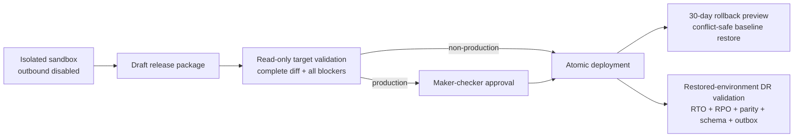

# E19 Sandbox, Release And Recovery Closure

**Scope:** sandbox provisioning, governed configuration promotion, production
approval, atomic deployment, safe rollback and disaster-recovery validation.
**Status:** first-party implementation closed and verified on 2026-07-27.

## 1. Architecture Decision

E19 uses a database-backed release control plane rather than scripts or mutable
files. `platform.environment_configuration` is the authoritative, versioned
configuration store for DEV, QA, UAT and PROD. A release package contains an
immutable ordered set of UPSERT/REMOVE components. Validation, deployment,
rollback and recovery exercises create append-only evidence records.

The command service is the single enforcement boundary. The React workspace is
an operator surface, not an authorization or workflow authority.

## 2. Safety Invariants

- A sandbox begins with a full configuration snapshot and email, webhook and
  integration egress disabled. Enabling any egress requires the exact risk
  acknowledgement recorded in audit evidence.
- Release components can change only while the package is `DRAFT`; PostgreSQL
  rejects later mutation.
- Validation is side-effect-free for the target. It records the complete diff,
  every blocker and a SHA-256 package fingerprint.
- Deployment accepts only the most recent valid fingerprint. Production also
  requires an approved `RELEASE_PROMOTION` maker-checker request; the maker
  cannot approve their own request.
- The target writes, package transition, deployment evidence, audit entry and
  outbox event share one transaction. Any failure rolls the target back.
- Rollback first compares live checksums with the deployed snapshot. Later
  releases therefore block rollback rather than being silently overwritten. A
  permitted rollback restores the exact pre-deployment snapshot.
- Expected rollback refusal is durable evidence (`BLOCKED`) and never changes
  target configuration.
- Recovery validation runs against the restored database and certifies RTO,
  RPO, authoritative row-count parity, Flyway version, backup checksum and
  transactional-outbox continuity. Failed checks are all returned in one run.

## 3. Authorization And Tenant Isolation

All records carry `tenant_id`, tenant-consistent foreign keys and forced RLS.
Read access is limited to governed administrator, auditor and operations roles.
All mutations require a master administrator; `SUPER_AUDIT` and `AUDITOR` are
read-only. Production approval is independent of release submission through the
maker-checker service. Platform super administrators operate across tenants
through authenticated tenant context; tenant identity is never accepted from a
request payload.

## 4. Data And API Surface

Migration `V348__sandbox_release_and_dr_control_plane.sql` owns:

- `platform.sandbox_environment` isolation and outbound-safety attributes;
- `platform.environment_configuration` versioned target state;
- `platform.release_component` immutable release contents;
- `platform.release_validation_run` append-only validation/diff evidence;
- `platform.deployment_run` exact baseline and deployed snapshots;
- `platform.release_rollback_run` successful and blocked rollback evidence;
- `platform.dr_validation_run` append-only recovery certification evidence.

The `/api/v1/release` contract exposes sandbox inventory/creation/egress,
package/component authoring, validation, approval submission and decisions,
deployment, rollback preview/execution, recovery baseline and DR validation
history. The `/sandbox` workspace provides the same workflow with explicit
gates, evidence panels, dialogs and status notifications.

## 5. Operator Runbook

1. Create a sandbox. Confirm all outbound controls display **Off**.
2. Create a release package and add its ordered configuration components.
3. Run **Validate**. Resolve every blocker and review the complete target diff.
4. For PROD, request approval and have a different authorized administrator
   approve it. For DEV/QA/UAT, proceed after successful validation.
5. Deploy. Record the deployment run number and SHA-256 fingerprint.
6. Use rollback preview before rollback. A blocked preview means a later release
   changed the target and must be resolved through a new forward release.
7. For a DR rehearsal, restore the backup into an isolated environment, capture
   the source baseline, then submit restore timestamps, event watermark,
   expected counts, backup reference and SHA-256 checksum. A `PASS` result is the
   release evidence; any failed check prevents certification.

The product is storage-provider-neutral. Backup creation, regional failover and
DNS switching are infrastructure operations; E19 supplies the complete
first-party validation and evidence layer without vendor professional services
or a code deployment.

## 6. Closure Evidence

The Docker-free local proof executed the complete path against PostgreSQL schema
version 348:

- sandbox `7a33943d-5dfe-444d-a525-c061a52805d7` was created with egress off;
- package `04cd2bb8-22bc-4841-b01c-55f142f4d266` validated with zero blockers;
- approval `c0f10fa6-cef6-4adc-8a82-4292dbf71431` was submitted by the maker and
  approved by an independent tenant administrator;
- deployment `fd8a0403-be0a-4e36-98b8-2b898d7a60fc` succeeded atomically;
- the first rollback restored one component; a repeated rollback was durably
  blocked and left the target unchanged;
- a SINGLE_AZ recovery exercise passed 11 checks with a 4-second RTO, zero-second
  RPO, row parity, schema 348, checksum evidence and outbox continuity;
- `ReleaseManagementServiceTest` proves fail-closed egress acknowledgement,
  invalid recovery chronology, governed read access and auditor write denial;
- backend compilation/tests, frontend production build and the live `/sandbox`
  browser surface pass without Docker. The browser reports no console errors.

