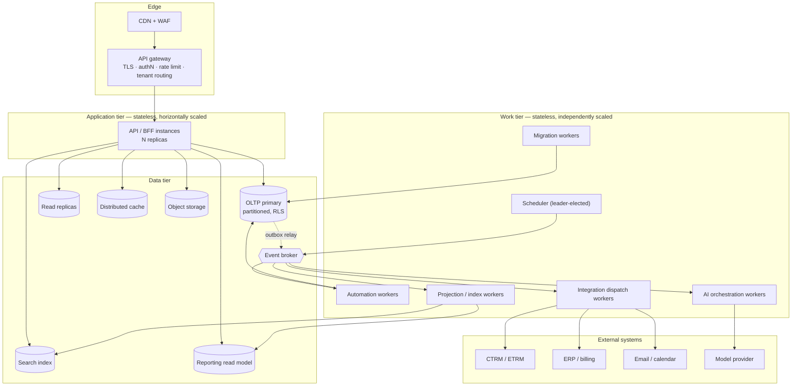
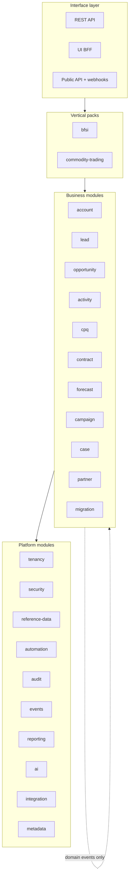
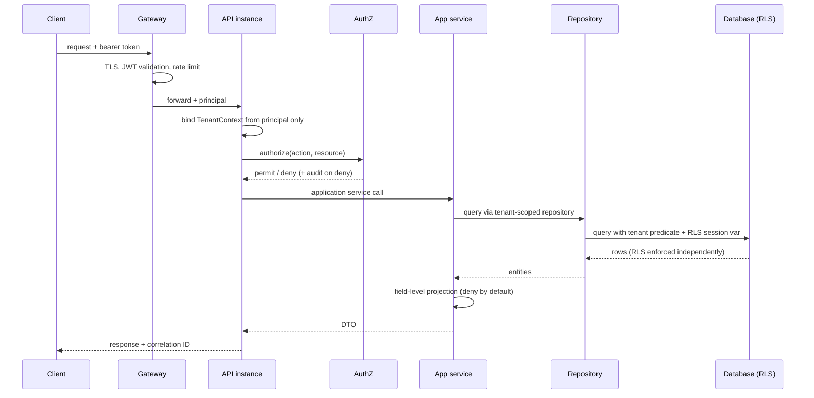
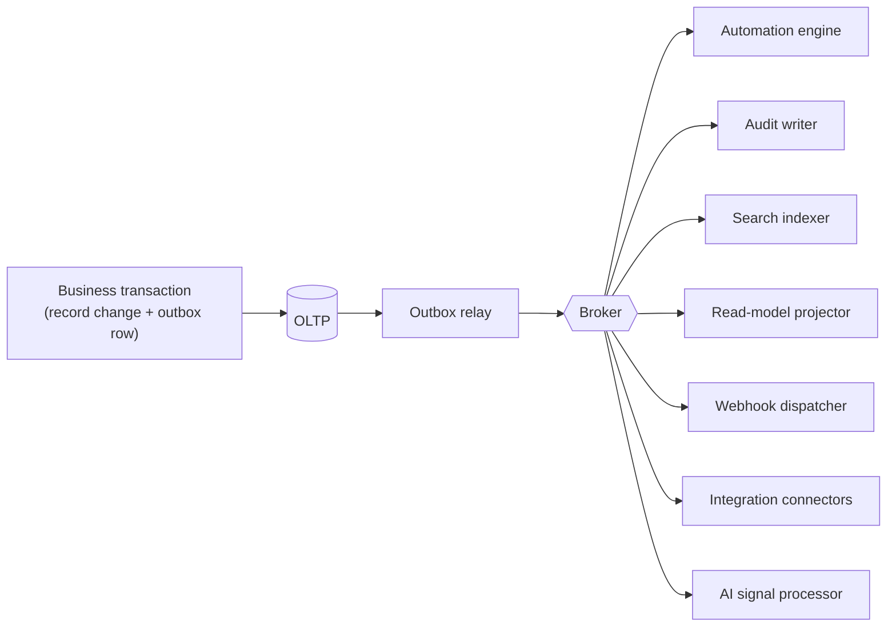
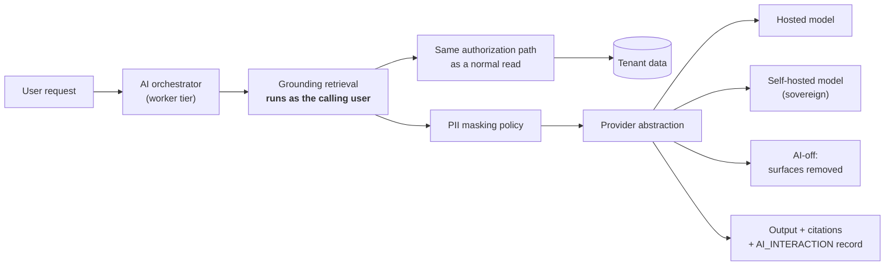
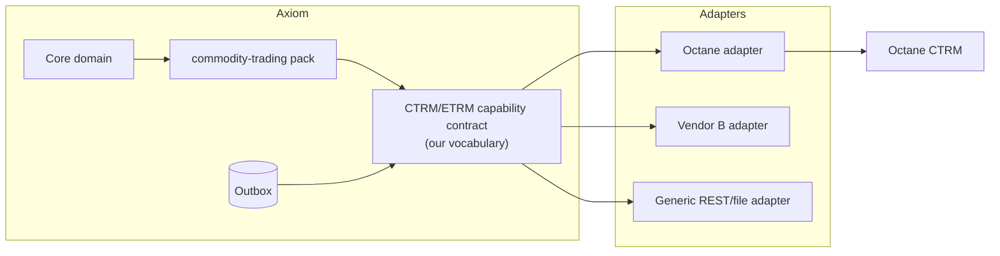

# System design

**Product:** Axiom — Enterprise B2B CRM
**Status:** Baseline architecture for build planning
**Date:** 2026-07-25

---

## 1. What this architecture has to survive

Architecture decisions are only defensible against the forces acting on them. These are the forces, in the order they will actually bite:

| # | Force | Consequence for the design |
|---|---|---|
| **D1** | **Transactional coupling in the CRM core.** Lead → account → opportunity → quote → order is one consistency boundary. A forecast that does not reconcile to its opportunities is a defect, not an eventual consistency window. | The core cannot be split into services without sagas everywhere. §3 |
| **D2** | **Wildly uneven workload shapes.** An interactive record save is 50 ms. An automation cascade, an AI call, a 2M-record migration and a report over 10M rows are seconds to hours. | Request path and work path must scale independently. §4 |
| **D3** | **Tenant size skew of several orders of magnitude.** A 40-seat tenant and a 5,000-seat tenant share infrastructure. | Isolation and quota controls are structural, not operational afterthoughts. §6 |
| **D4** | **Three deployment models from one codebase** — pooled SaaS, dedicated, sovereign on-premises. | Tenancy must be infrastructure, never domain logic. [ADR-001](adr/ADR-001-tenancy-isolation.md) |
| **D5** | **Runtime-defined schema.** Tenants add objects and fields; those behave identically to built-in ones everywhere. | Metadata-driven persistence, query and API. [ADR-002](adr/ADR-002-extensibility-model.md) |
| **D6** | **External systems of record we do not own** — CTRM/ETRM, ERP, e-signature, email. They will be slow, down, and will change shape. | Anti-corruption layer and fail-safe degradation. [ADR-007](adr/ADR-007-external-system-integration.md) |
| **D7** | **Audit and explainability are functional requirements**, not logging. Every number decomposes; every AI output cites. | Events and lineage are first-class, designed in. [ADR-003](adr/ADR-003-event-backbone.md) |
| **D8** | **Analytics must not contend with transactions.** Reporting on the write path is the classic way enterprise CRMs become slow. | Separate read model. [ADR-008](adr/ADR-008-reporting-read-model.md) |

The architecture below is a direct response to these eight. Anything in it that does not trace to one of them is decoration.

---

## 2. Architecture at a glance

**One deployable artifact, three runtime roles.** The API instances, the workers and the scheduler are the *same* build, started with a different role flag. This keeps the modular monolith honest: there is no way for a worker to accumulate logic the API cannot see, and no separate deployment pipeline to drift.

---

## 3. Style: modular monolith, not microservices

**Decision:** a modular monolith with build-enforced module boundaries, deployed as horizontally scalable stateless instances. Full reasoning in [ADR-006](adr/ADR-006-modular-monolith.md).

The short version: force **D1** makes the CRM core one transactional cluster. Splitting `account`, `opportunity`, `quote` and `order` into separate services buys nothing and costs a saga on every business operation, plus a distributed failure mode for every previously-atomic write. Microservices solve *organizational* scaling problems that a team building a first release does not yet have. Meanwhile the *technical* scaling problem — force **D2** — is solved by separating the request path from the work path (§4), which does not require service decomposition at all.

This is also the architecture the sibling Octane CTRM platform chose, for the same reasons, and it has held.

### 3.1 Module structure

Modules correspond one-to-one with the FRD module codes, so a requirement's owner is unambiguous.

### 3.2 Boundary rules — enforced, not documented

These are checked by an architecture test that **fails the build**. A rule that is only written down is not a boundary.

| # | Rule |
|---|---|
| **B1** | A module owns its entities. No module reads or writes another module's persistence directly. |
| **B2** | Cross-module calls go through a published application-service interface in the owning module's API package. Internal packages are not importable. |
| **B3** | Dependencies point downward only: interface → packs → business → platform. Never upward. |
| **B4** | **No cycles between modules.** A detected cycle fails the build. |
| **B5** | Business modules do not call each other synchronously where eventual consistency is acceptable — they publish domain events. Synchronous cross-module calls are permitted only inside one consistency boundary and must be justified in code review. |
| **B6** | Vertical packs may depend on business and platform modules. **No core module may depend on a pack.** A pack's removal must not break a build or a query. |
| **B7** | Every persistence operation goes through the tenant-scoped repository base. There is no path to the data tier that bypasses tenant context. |

**B6 is the one that decides whether "vertical depth as configuration" is a real claim or marketing.** If a core module ever imports from `commodity-trading`, the pack framework has failed and both vertical packs become permanent core weight.

### 3.3 Extraction path

Modules are structured so that specific ones can become independent services **when a measured need appears**, not before. The candidates, in order, are exactly those with a different scaling curve from the core and no transactional coupling to it:

1. **AI orchestration** — slow, bursty, external dependency, its own cost curve
2. **Migration engine** — long-running, resource-hungry, per-customer, episodic
3. **Reporting / query** — read-only, different hardware profile, already separated by [ADR-008](adr/ADR-008-reporting-read-model.md)
4. **Integration dispatch** — I/O-bound, retry-heavy, external latency
5. **Search indexing** — already event-driven

**Deliberately never extracted:** account, contact, lead, opportunity, quote, order, contract. These are one transactional cluster (**D1**). Splitting them is the mistake this architecture exists to avoid.

Because these five already run as separate worker roles consuming events, extraction is a deployment change, not a rewrite. That is the point of doing it this way.

---

## 4. Scaling model

Force **D2** is the real scaling problem, and it is a *workload separation* problem before it is a *capacity* problem.

### 4.1 The four tiers scale independently

| Tier | State | Scaling | Bottleneck | Trigger to scale |
|---|---|---|---|---|
| **API / BFF** | Stateless | Horizontal, autoscaled | CPU, connection pool | p95 latency, CPU > 65% |
| **Workers** | Stateless, per queue | Horizontal per queue | Queue depth | Queue depth, oldest-message age |
| **Scheduler** | Leader-elected singleton | Not scaled; HA by failover | — | — |
| **Data** | Stateful | Vertical + read replicas + partitioning → sharding | IOPS, connections, lock contention | Replication lag, connection saturation |

**Separating the work tier from the request tier is the single highest-value scaling decision in this design.** An automation cascade, an AI call and a 2M-row migration must never compete for the thread pool serving a rep trying to save an opportunity. Each worker class has its own queue, its own concurrency limit and its own scaling policy — so a tenant running a huge migration slows down migrations, not everyone's record saves.

### 4.2 Horizontal scaling

- **Sessions are not held in application memory.** Session state lives in the distributed cache; any instance serves any request. This is what makes the API tier trivially horizontal.
- **No instance affinity, no sticky sessions.**
- **Idempotency keys** (`FR-GLOBAL-006`) make retries across instances safe.
- **Long operations are jobs, never held HTTP requests.** Bulk operations, migrations, exports and report generation return a job handle immediately. Nothing that can exceed a few seconds is allowed to occupy a request thread.
- **The scheduler enqueues; it never executes.** It is a singleton that emits work, so failing over costs nothing.

### 4.3 Vertical scaling

The OLTP primary scales vertically first, and that is the correct order — a single well-provisioned relational primary handles a very large workload, and every distribution strategy costs consistency, operational complexity or both. Partitioning the high-volume entities (`ACTIVITY`, `AUDIT_EVENT`, `FIELD_HISTORY`, `RECORD_SHARE`, snapshots) by tenant and time extends that runway substantially.

### 4.4 The staged scaling path

Stated honestly, with the trigger for each stage rather than a promise that any one of them is sufficient forever.

| Stage | Scale | What is added | Trigger for the next stage |
|---|---|---|---|
| **1** | 0–100 tenants | Single region. Primary + standby + 2 read replicas. 3+ API replicas, 2+ workers per queue. | Replication lag, or replicas saturated by reporting |
| **2** | 100–1,000 tenants | Table partitioning; reporting read model on its own storage; distributed cache; dedicated worker pools per class. | Connection saturation on the primary, or write contention |
| **3** | 1,000+ tenants, or any single very large tenant | **Tenant sharding.** Tenants routed to database shards by a tenant→shard directory. App tier stays stateless and shard-aware; a large tenant gets its own shard. | Operational complexity, or a component with a genuinely divergent scaling curve |
| **4** | Selective | Extract the five candidates in §3.3 as services. | Measured need only |

**Sharding is cheap in this model precisely because of decisions made now, not later:** every entity is tenant-scoped (`M1`), keys are opaque and non-sequential (`M2`), no foreign key crosses a tenant (`M5`), and there is no cross-tenant query anywhere in the product. Adding a shard directory is a routing change. If any one of those four rules is broken before Stage 3, sharding becomes a data migration project instead — which is why they are constraints in the [data model](../product/09-data-model.md), not preferences.

### 4.5 What is *not* claimed

- This design does not make an arbitrarily large single tenant infinitely fast. A single tenant with 10M opportunities will need its own shard, and its heaviest reports will run against the read model, not the OLTP store.
- Stage 3 sharding adds real operational burden: shard-aware migrations, per-shard backup, rebalancing. It is deferred because it should be, not because it is free.
- Extraction to services (Stage 4) trades local calls for network calls. It should be triggered by measurement, never by architecture fashion.

---

## 5. Request path

Three properties of this path matter more than the rest:

1. **Tenant context binds from the authenticated principal and nowhere else.** No header, parameter or body field can influence it. This is the single control that makes multi-tenancy safe.
2. **Authorization happens at the application-service boundary** — one choke point, not scattered across controllers. A new API surface over an existing service inherits its authorization automatically rather than needing it re-implemented.
3. **Field-level security is applied at serialization, deny-by-default.** A field the user cannot read is *absent*, not null (`FR-SEC-007`), so absence and emptiness are never conflated.

### 5.1 Defence in depth on tenancy

Application-level tenant scoping **and** database row-level security, independently. This is deliberate redundancy: an application bug — a hand-written query, a missed repository base class, a new developer's shortcut — must not become a cross-tenant data leak. RLS is the backstop that turns a serious bug into a failed query.

---

## 6. Multi-tenancy and noisy neighbours

Full decision in [ADR-001](adr/ADR-001-tenancy-isolation.md). Shared schema, `tenant_id` on every row, RLS enforced.

**The same artifact serves all three deployment models.** Pooled SaaS runs many tenants; dedicated runs one tenant on isolated infrastructure; sovereign runs one tenant on customer-controlled infrastructure with a self-hosted or disabled model provider. A sovereign install is *one tenant in the standard schema running the standard code*. There is no sovereign build, no feature fork, no separate release train — which is the only way the claim in §5.2 of the [competitive analysis](../product/02-competitive-analysis-salesforce-zoho.md) is defensible over time.

**Noisy-neighbour controls** (force **D3**) are structural:

| Control | Mechanism |
|---|---|
| API fair use | Per-tenant token bucket at the gateway, published limits, standard rate-limit headers (`FR-INT-003`) |
| Automation | Per-tenant concurrency cap and execution budget; overflow queues rather than starving others |
| AI | Per-tenant rate and cost budget with visible telemetry (`FR-AIX-015`) |
| Reporting | Per-tenant query concurrency limit, statement timeout, row cap (`FR-RPT-011`) |
| Bulk / migration | Dedicated worker pool, throttled, never on the interactive path |
| Storage | Per-tenant quota with soft-limit warning before hard enforcement |

Note the shape of every one of these: **throttle, never cap by tier**. `FR-GLOBAL-011` and `FR-AUT-014` forbid buying differentiation by withholding capacity. Fair-use protection is an engineering necessity; a tier-gated feature limit is a commercial choice we have explicitly rejected.

---

## 7. Event backbone

Full decision in [ADR-003](adr/ADR-003-event-backbone.md).

**Transactional outbox.** Domain events are written to an outbox table *in the same transaction* as the business change. A relay publishes them to the broker and marks them dispatched.

This exists because the naive alternative — write to the database, then publish to the broker — is broken in both directions: a rolled-back transaction can still publish a phantom event, and a committed transaction can lose its event if publishing fails. For a product where audit and automation are functional requirements (**D7**), neither failure is acceptable.

- **Delivery is at-least-once. Every consumer is idempotent.** Exactly-once is not offered because it cannot be honestly delivered end to end; idempotent consumers are the design that actually works.
- **Ordering is guaranteed per record**, not globally — partition key is `(tenant_id, entity_id)`.
- **Failures go to a dead-letter queue** with replay. A permanently failing consumer must not block the stream (`FR-INT-005`).
- Consumer lag is monitored per consumer group; sustained lag on the audit or projection consumers is a production incident, not a metric.

---

## 8. Reporting and search

### 8.1 Reporting read model

Full decision in [ADR-008](adr/ADR-008-reporting-read-model.md). Analytical queries are served from a projection maintained by event consumers plus scheduled snapshots — not from the OLTP tables (force **D8**).

- Drill-through from an aggregate goes back to the authoritative record **with a fresh permission check** (`FR-RPT-006`). The projection is for aggregation; it is never the authority on what a user may see.
- Snapshot tables (`PIPELINE_SNAPSHOT`, `FORECAST_SNAPSHOT`) are written on schedule and are immutable, which is what makes historical trending (`FR-RPT-008`) and the forecast movement waterfall (`FR-FCT-006`) exact rather than reconstructed.
- The projection is eventually consistent, and **the staleness is displayed to the user**. A report that is 30 seconds behind is fine; a report that is silently 30 seconds behind while a manager reconciles it against a record page is not.

### 8.2 Search

Search is a dedicated index updated from events, partitioned per tenant.

**Permission filtering is the hard part and is worth stating plainly.** Access can change faster than an index can be rebuilt, so the index is not treated as authoritative for authorization. The approach: index `tenant_id`, owner and sharing keys; filter on them at query time; then **re-check the returned page against the authoritative store before display**. This costs a little latency on the result page and is the only version that is correct. Indexing a materialized ACL and trusting it would be faster and would eventually show someone a record they had just been removed from.

---

## 9. Security architecture

| Layer | Control |
|---|---|
| Edge | TLS 1.3, WAF, DDoS protection, per-tenant rate limiting |
| Identity | SSO (SAML/OIDC), MFA, SCIM, short-lived tokens, refresh rotation |
| Session | Server-side session state, revocable immediately (`FR-TEN-010`) |
| Tenant | Application context + database RLS, independently (§5.1) |
| Authorization | Single choke point at the application-service boundary |
| Field | Deny-by-default projection at serialization |
| Controlled actions | Step-up authentication (`FR-TEN-009`), maker-checker (`FR-SEC-010`) |
| Secrets | Managed secret store; never in configuration, images or logs |
| Data at rest | Encryption with tenant-scoped keys; customer-managed keys for sovereign (`FR-AUD-012`) |
| Data in transit | TLS everywhere, including internal hops |
| Audit | Append-only, hash-chained, no update or delete rights for any role (`FR-AUD-001`) |
| Egress | Allowlisted destinations; outbound calls via named credentials only |

**Two rules that are easy to state and easy to violate under delivery pressure:**

1. **No service account bypasses authorization.** Background jobs, projections and AI retrieval all run with an explicit principal and pass through the same authorization path. The moment one component gets a "trusted internal" fast path, the security model has a hole that no amount of review will reliably find later.
2. **Logs and metrics never contain credentials or unmasked personal data** (`FR-AUD-014`). This is enforced by a serialization allowlist, not by reviewer discipline.

---

## 10. AI architecture

Full decision in [ADR-004](adr/ADR-004-ai-provider-abstraction.md).

**The critical control, stated bluntly: grounding retrieval executes with the calling user's permissions, through the ordinary authorization path.** A retrieval component running as a privileged service account is the single most likely way this product would leak data between users — it would be fast, it would look correct in every demo, and the failure would be silent. It is therefore prohibited, and the prohibition is enforced by the same rule as §9.1.

Supporting properties:
- **Per-tenant embedding namespace.** No shared vector space across tenants (`FR-AIX-010`).
- **Every interaction produces an `AI_INTERACTION` record** with grounding record IDs, so citation (`FR-AIX-007`) is auditable after the fact, not merely rendered at the time.
- **Erasure reaches the AI stores.** Embeddings and caches are enumerable targets of the erasure process (`FR-AUD-008`) — the most commonly forgotten data store in a right-to-erasure implementation.
- **AI-off removes surfaces, not function.** It is a capability flag; no core workflow may depend on AI (`FR-AIX-013`).

---

## 11. Integration architecture and the CTRM connector

Full decision in [ADR-007](adr/ADR-007-external-system-integration.md).

### 11.1 Anti-corruption layer

Every external system sits behind an **anti-corruption layer**: a capability contract defined by *our* domain, with an adapter per vendor translating to it. External models never enter core domain code.

### 11.2 The CTRM/ETRM capability contract

Five capabilities, and no more — the contract is deliberately narrow because a wide one becomes a coupling surface:

| # | Capability | Direction | Semantics |
|---|---|---|---|
| C1 | Counterparty master sync | CTRM → CRM | Pull/push; CTRM-mastered fields are read-only in the CRM and display their source and sync time |
| C2 | Credit limit and utilisation read | CTRM → CRM | Cached as `CREDIT_SNAPSHOT` with `as_of` and staleness; **never computed by the CRM** |
| C3 | Master agreement read | CTRM → CRM | Status drives origination gating (`FR-CTM-002`) |
| C4 | Deal-agreed hand-off | CRM → CTRM | Async, idempotent, acknowledged; returns a trade reference stored on the origination |
| C5 | Trade status callback | CTRM → CRM | Confirms, amends or cancels; updates the origination's downstream state only |

**Octane is one adapter implementing this contract, not a dependency of the design.** That was the explicit product decision, and it matters technically as well as commercially: the moment the contract is shaped around one vendor's API, every other CTRM becomes a custom project.

### 11.3 Failure isolation — the part that decides whether this is enterprise-grade

| Failure | Behaviour |
|---|---|
| CTRM unavailable | CRM stays **fully usable** for relationship and origination work |
| Credit data stale or unreachable | Credit gate **fails closed**, stating the reason and the as-of time (`FR-CTM-003`). It never passes on missing data, and never silently presents a stale number as current |
| Hand-off not acknowledged | Queued with retry and backoff; surfaced on an exception queue; the origination is **not** reported as handed off until acknowledgement arrives (`FR-CTM-009`) |
| Duplicate delivery | Idempotency key `(origination_id, version)` makes redelivery a no-op |
| CTRM schema change | Absorbed in the adapter; contract and core domain unchanged |
| Sustained failure | Circuit breaker opens; integration health surfaces it to a human within a defined window (`FR-INT-009`) |

**No shared database between the CRM and any CTRM, ever.** A shared schema between two products couples their release cycles permanently and makes each one's refactoring the other's outage. Integration is via the contract, or it does not happen.

---

## 12. Availability and disaster recovery

| Aspect | Design |
|---|---|
| API and workers | Multi-AZ, N+1, rolling deploys with health gating |
| Database | Primary with synchronous standby in a second AZ; automatic failover |
| Cross-region | Asynchronous replica in a second region for regional loss |
| Backups | Continuous WAL/log archiving plus periodic full backups; retention per policy |
| Restore | **Rehearsed on a schedule.** An unrehearsed restore procedure is an assumption, not a capability |
| Object storage | Versioned, replicated |
| Event broker | Replicated; outbox is the source of truth, so a broker loss is recoverable by replay |
| Degraded modes | Cache miss → database; search down → database-backed list views; AI down → surfaces hidden; CTRM down → §11.3 |
| Targets | RTO/RPO per tier defined in the [NFR document](../product/10-nfr-and-enterprise-readiness.md) |

The degraded-mode row is the one that separates a design that survives an incident from one that merely documents an SLA. Every dependency in this architecture has a defined behaviour when it is absent, and none of them is "the product stops".

---

## 13. Environments

`dev` → `qa` → `uat` → `prod`, plus a **per-tenant sandbox** available in every commercial tier (`FR-ADM-005`).

**Sandboxes have outbound email, webhooks and integrations disabled by default.** This is a hard default, not a checkbox an administrator is trusted to remember, because the failure it prevents — a test run emailing real customers from a copy of production data — is unrecoverable and career-defining.

Configuration promotes through validated change sets with a diff against the target (`FR-ADM-006`); a failed deployment leaves the target untouched and reports every blocking issue, not the first.

---

## 14. Technology selection

Formally open — see [ADR-005](adr/ADR-005-technology-selection-deferred.md). Nothing above depends on a specific stack.

A **reference stack** is recommended there on the basis that the sibling Octane CTRM platform has already proven it for an enterprise workload of comparable shape, and that reusing a stack the team operates well is worth more than a marginally better technology it does not. That recommendation is explicitly not yet a decision.

---

## 15. Open architectural questions

Recorded rather than assumed. Each needs an answer before the sprint that depends on it.

| # | Question | Needed by | Current lean |
|---|---|---|---|
| **Q1** | Slot count per data type for extensibility, and the provisioning path on exhaustion | Sprint 3 | Generous initial allocation; documented expansion as an operational task ([ADR-002](adr/ADR-002-extensibility-model.md)) |
| **Q2** | Read model in the same engine as OLTP, or a separate analytical store? | Stage 2 | Same engine, separate storage first; revisit at measured scale |
| **Q3** | Sharding key — tenant only, or tenant + entity for very large tenants? | Stage 3 | Tenant only; a very large tenant gets a dedicated shard |
| **Q4** | Search: self-hosted index vs. managed service, given sovereign deployments must run it too | Sprint 6 | Self-hostable, since sovereign is a first-class model |
| **Q5** | Broker technology, given a sovereign install must run the whole stack | Sprint 4 | **Kafka**, for a 50,000-user target scale — see [ADR-005](adr/ADR-005-technology-selection-deferred.md). Self-hostable; outbox makes it replaceable regardless |
| **Q6** | Do sovereign installs get the read model, or degraded reporting? | Before first sovereign sale | Full read model; sovereign is not a lesser product |

---

## Related documents

- **ADRs:** [001 tenancy](adr/ADR-001-tenancy-isolation.md) · [002 extensibility](adr/ADR-002-extensibility-model.md) · [003 event backbone](adr/ADR-003-event-backbone.md) · [004 AI provider](adr/ADR-004-ai-provider-abstraction.md) · [005 technology](adr/ADR-005-technology-selection-deferred.md) · [006 modular monolith](adr/ADR-006-modular-monolith.md) · [007 external integration](adr/ADR-007-external-system-integration.md) · [008 reporting read model](adr/ADR-008-reporting-read-model.md)
- [Data model](../product/09-data-model.md) · [FRD](../product/03-frd.md) · [NFR and enterprise readiness](../product/10-nfr-and-enterprise-readiness.md)
- [Tenancy, licensing and deployment](../product/16-tenancy-licensing-and-deployment.md) · [Commodity trading pack](../product/17-vertical-pack-commodity-trading.md)
