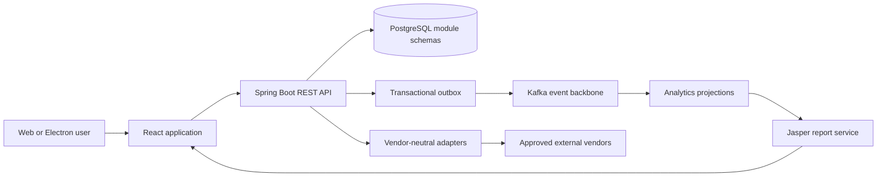
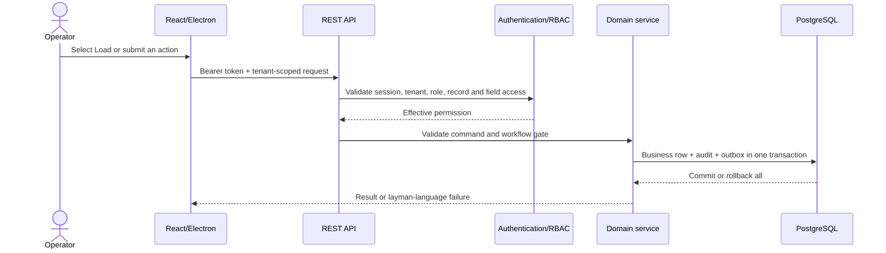
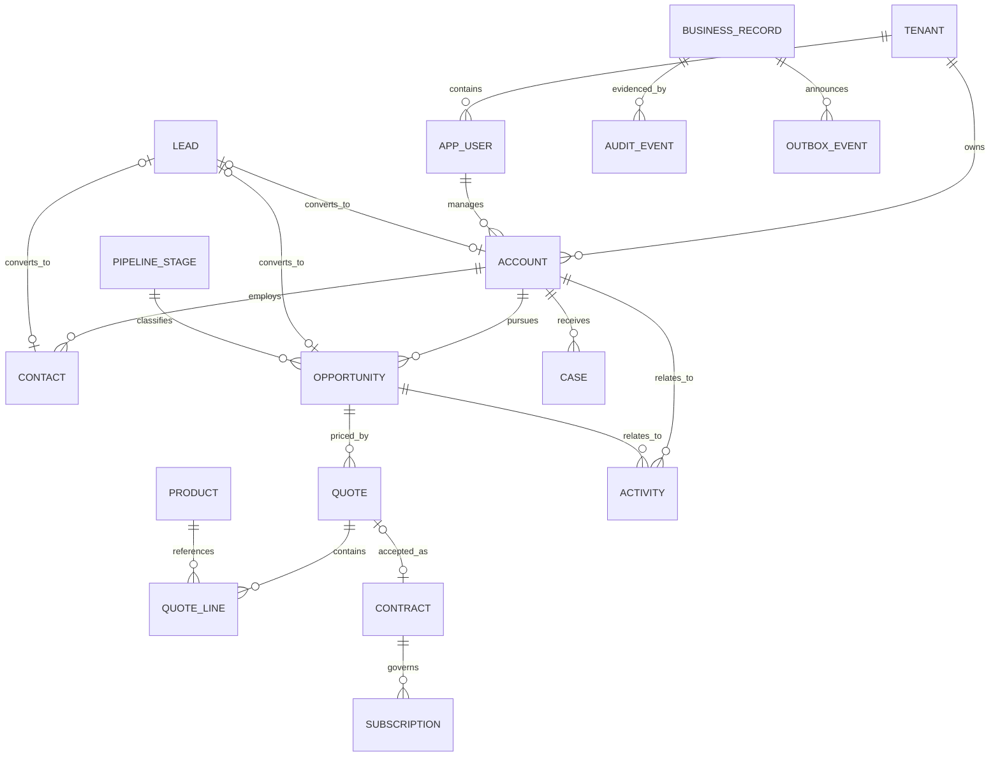
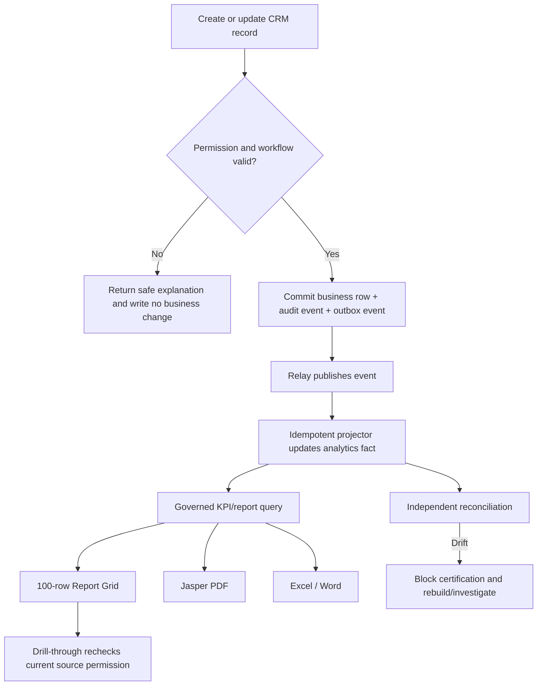
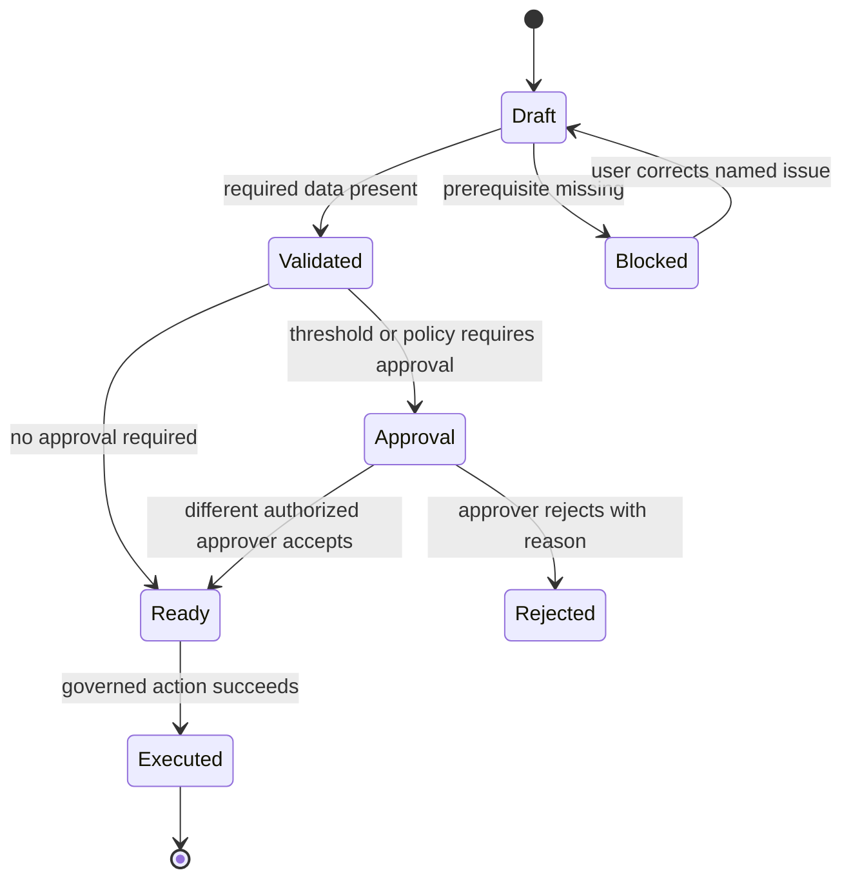
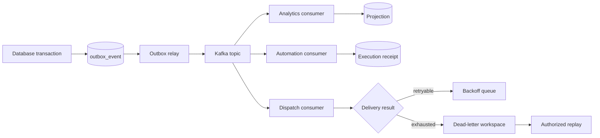
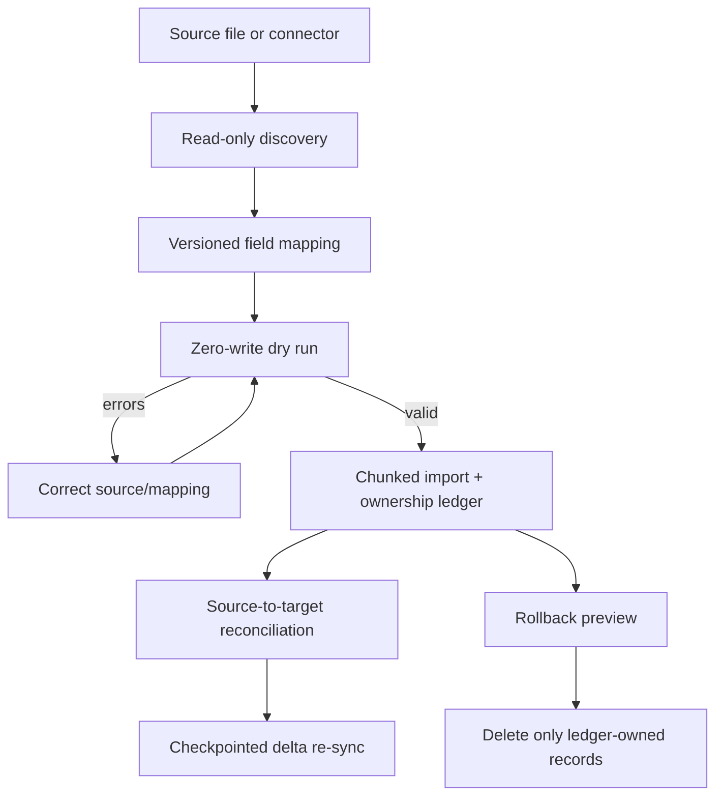
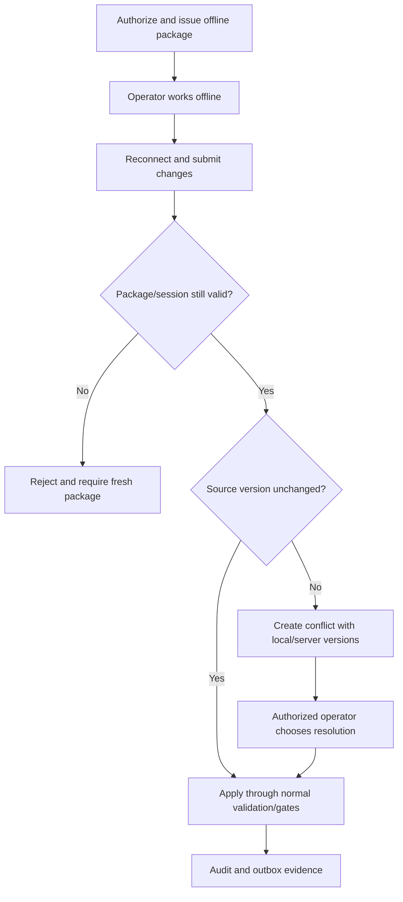

# Axiom CRM 1.0 - Technical Architecture And Data Flow

## 1. Executive explanation

Axiom is a multi-tenant revenue platform built as a modular monolith. In plain language, the product is deployed as one API application, but its code and database are divided into owned modules with explicit boundaries. That gives the team one operational unit today while preserving an extraction path for a module that later needs independent scale.

The browser and Electron client never connect to PostgreSQL or Kafka directly. They call the REST API. The API authenticates the user, establishes tenant context, authorizes the screen and record, validates the request, checks workflow gates and writes business data. Every accepted mutation writes immutable audit evidence and an outbox event in the same database transaction.

## 2. System context

The external-vendor box is an adapter boundary. First-party workflows are complete without pretending that an unconfigured mail, identity, finance, telephony or trading vendor is available.

## 3. Request and authorization flow

Defence is layered: signed session, tenant context, screen permission, record authorization, field protection, service predicates, foreign keys/checks, and forced PostgreSQL row-level security. A missing UI button is convenience; server and database enforcement are authority.

## 4. Core entity relationship model

Every tenant-owned row carries `tenant_id`. UUID primary keys identify records. Foreign keys protect relationships. Unique/check constraints prevent duplicate or impossible states. Business masters are soft-deleted; a referenced value cannot be removed.

## 5. Create-to-report flow

The report projection is optimized for reading but is not a second source of truth. Dataset fingerprints and row counts prove grid/PDF/Excel/Word parity. Reconciliation compares projection results with independent operational recomputation.

## 6. Workflow activity model

Concrete modules specialize this model: opportunity stages, quote/discount approval, contract activation and renewal, forecast submission/lock, campaign and case lifecycle, partner registration, automation simulation, migration validation/rollback, BFSI onboarding and commodity execution handoff.

## 7. Module and schema ownership

| Area | Schemas | Responsibility |
|---|---|---|
| Platform identity | `platform`, `identity`, `security` | tenants, users, sessions, SSO/SCIM, RBAC, sharing, step-up and record locks |
| Core CRM | `crm`, `leads`, `pipeline` | accounts, contacts, leads, opportunities, duplicate control and lifecycle |
| Engagement | `engagement`, `marketing`, `service`, `channel` | activities, templates, campaigns, cases, partners and alerts |
| Revenue | `cpq`, `contracting`, `forecasting`, `billing` | products, prices, quotes, orders, contracts, subscriptions, forecast and billing controls |
| Intelligence | `analytics`, `reporting`, `ai` | projections, governed KPIs, report definitions, Jasper artifacts and grounded recommendations |
| Orchestration | `automation`, `integration`, `dispatch`, `migration` | processes, gates, approvals, outbox, connector delivery, migration and recovery |
| Governance | `governance`, `compliance`, `documentation`, `i18n`, `activity` | audit, privacy/retention, manual master, translations and user activity |
| Extended operations | `mobile`, `bfsi`, `commodity` | offline packages/conflicts and vertical workflow packs |

Cross-module calls go through published services. A module does not reach into another module's internal package. Database table ownership is registered in `governance.module_table_catalog`.

## 8. Event and failure recovery flow

Consumers use event identity/receipts so redelivery does not duplicate work. External failures never roll back an already-committed CRM transaction. Retry, dead-letter and replay remain visible to operators.

## 9. Migration and bulk data flow

Master CSV imports validate the complete file and commit atomically, with a 5,000-row and 5 MiB synchronous limit. Lead JSON batches accept up to 1,000 rows with per-row outcomes. Larger migrations use resumable asynchronous jobs, not a browser request containing a million records.

## 10. Offline synchronization activity

## 11. Deployment and observability

The development topology runs React/Vite on port 4280 and the Spring Boot API on 8080, with PostgreSQL on 5432. Production uses built static assets behind the approved web tier and horizontally scaled stateless API nodes. Kafka is the event backbone; PostgreSQL remains the transactional source of truth. Prometheus-compatible metrics cover request latency/error/saturation, pool usage, event lag, projection freshness and job failures.

Backup and disaster recovery require continuous WAL/archive policy, encrypted backups, a separate recovery location, tested restore, recorded RPO/RTO evidence and an approved release rollback path. A runbook is not certified until a rehearsal succeeds.

## 12. Impact analysis

| Change | Direct impact | Indirect impact and mandatory regression |
|---|---|---|
| Account/contact field | CRM validation and UI | search index, duplicate rules, report projection, exports, permissions, migration mapping and documentation |
| Opportunity stage/amount/date | pipeline lifecycle | workflow gates, forecast snapshots, weighted pipeline, velocity/conversion, alerts and Jasper parity |
| Product/price/discount | CPQ | quote totals, approvals, margin report, order/contract conversion and audit |
| Contract/subscription | contracting | ARR/ACV/TCV, renewal/churn, billing handoff, Customer 360 and alerts |
| RBAC/sharing | authorization | every screen/API/report/drill/export/search result; maker-checker and tenant-isolation tests |
| KPI definition | analytics registry | dashboard, report, threshold alert, historical version, reconciliation and explanatory manual |
| Event schema | producer/outbox | every consumer, replay/idempotency, projection rebuild and compatibility contract |
| Reference master | selecting modules | historical label, in-use delete protection, import/export template and report filters |
| Translation/manual content | i18n/documentation | header sizing, every locale fallback, drawer master revision and PDF manual |

## 13. Architectural non-negotiables

1. No hard delete for governed masters.
2. No tenant query without enforced tenant context and row-level security.
3. No mutation without matching audit/outbox evidence.
4. No report aggregate that cannot expose formula, version and contributing records.
5. No drill-through without a fresh authorization check.
6. No workflow shortcut through UI, API, automation, import or support SQL.
7. No dry-run that writes business state.
8. No migration rollback beyond records proven to be migration-owned.
9. No vendor integration claimed complete without configured vendor certification.
10. No release described as zero-failure without named automated and manual evidence.

