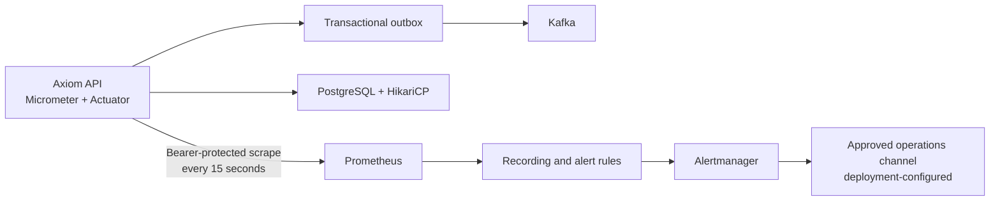

# Prometheus operations for Axiom CRM

## Purpose and boundary

Prometheus is Axiom's operational truth, not its CRM reporting database. It answers:

- Is the API available, fast and below its error budget?
- Is PostgreSQL connection capacity saturated?
- Are transactional events reaching Kafka quickly enough for reporting, search and automation to remain fresh?
- Are automation, Jasper reporting, edit locking and maker-checker controls succeeding?
- Did a release change latency, failures or resource saturation?

Customer 360, quota, forecast and revenue figures remain in governed PostgreSQL read models and Jasper reports. Putting tenant IDs, account IDs, emails, record IDs or report codes into Prometheus labels would expose data and create unbounded cardinality. Axiom therefore uses only bounded labels: `module`, `operation`, `outcome`, `application`, `environment`, `job` and `component`.

This follows Prometheus's naming and cardinality guidance: base units, `_total` counters, and no unbounded label values.

## Architecture



The Prometheus machine token is independent of CRM JWTs and grants access only to `/actuator/prometheus`. `/actuator/health` remains available to container probes. The general Actuator metrics catalogue is not exposed.

## Start and verify

Development has a deliberately non-production scrape token. QA, UAT and production must inject `AXIOM_PROMETHEUS_SCRAPE_TOKEN` from their secret manager; the API refuses to start with the development token outside dev/test.

```powershell
docker compose --env-file .env.dev up -d --build
docker compose ps
Invoke-RestMethod http://localhost:9090/-/ready
Invoke-RestMethod http://localhost:9096/-/ready
```

Local operator surfaces:

- Prometheus: `http://localhost:9090`
- Alertmanager: `http://localhost:9096` (container-internal port `9093`)
- Axiom API health: `http://localhost:8080/actuator/health`

Both observability ports bind to `127.0.0.1` by default. Production access belongs behind the platform reverse proxy and operator identity provider.

Direct scrape acceptance:

```powershell
$headers = @{ Authorization = "Bearer $env:AXIOM_PROMETHEUS_SCRAPE_TOKEN" }
Invoke-WebRequest http://localhost:8080/actuator/prometheus -Headers $headers
```

A missing or incorrect token must return `401`. Never put the token into a URL or query string.

## Axiom metric catalogue

| Metric | Type | Meaning |
|---|---|---|
| `http_server_requests_seconds_*` | Histogram | API rate, errors and latency by bounded Spring MVC route/status labels |
| `hikaricp_connections_*` | Gauge/counter | Database connection capacity and waiting requests |
| `jvm_*`, `process_*`, `system_*` | Gauge/counter | JVM, process, CPU, memory and garbage collection health |
| `axiom_crm_operations_total` | Counter | Automation, Jasper report, edit-lock and approval outcomes |
| `axiom_crm_operation_duration_seconds_*` | Timer histogram | Duration of the same governed operations |
| `axiom_outbox_backlog_events` | Gauge | Undispatched events across the platform |
| `axiom_outbox_oldest_event_age_seconds` | Gauge | Age of the oldest event waiting for Kafka |
| `axiom_outbox_metrics_refresh_failures_total` | Counter | Failures of the least-privilege outbox gauge query |

Useful PromQL:

```promql
job:axiom_http_duration_seconds:p95_5m
job:axiom_http_5xx_ratio:rate5m
sum by (module, operation, outcome) (increase(axiom_crm_operations_total[1h]))
axiom_outbox_oldest_event_age_seconds
hikaricp_connections_active{pool="axiom-app-pool"}
  / hikaricp_connections_max{pool="axiom-app-pool"}
```

## Alert response runbooks

### AxiomApiDown

Check the API container and `/actuator/health`, then inspect startup logs for Flyway, PostgreSQL or Kafka failures. If health is up but scrape is down, validate that Prometheus and the API received the same scrape token. Never bypass the filter.

### AxiomApiHighErrorRatio

Group HTTP metrics by bounded URI template, method and status; correlate with structured logs using correlation IDs; verify PostgreSQL and Kafka before deciding whether to roll back.

### AxiomApiHighLatency

Compare request p95 with Hikari pending/active/max gauges and JVM pauses. Identify the bounded route and review its query plan or projection freshness. Never add record IDs as labels.

### AxiomDatabasePoolSaturated

Check PostgreSQL reachability and blocked transactions before raising the pool size. Increasing the pool without database capacity evidence can amplify the incident.

### AxiomOutboxBacklogGrowing

Confirm Kafka health and inspect `OutboxRelay` warnings. Events remain durable in PostgreSQL. Do not delete outbox rows; restore delivery and let at-least-once replay drain them.

### AxiomOutboxOldestEventStale

Treat search, automation and reporting projections as potentially stale. Restore Kafka/relay delivery and verify event age returns below the threshold before resolving.

### AxiomAutomationFailures

Group operation metrics by outcome, then inspect the immutable automation trace. Dry-run and live executions are intentionally separate operations.

### AxiomMakerCheckerDenials

Review `SEGREGATION_VIOLATION` audit evidence and validate delegations. Never weaken the transitive four-eyes rule to silence the alert.

### AxiomOutboxMetricRefreshFailing

Validate the `axiom_relay` datasource and its outbox-only grants. Last-known gauges are retained; a query failure never reports a false zero.

## Deployment and retention policy

- Default local retention is 15 days (`AXIOM_PROMETHEUS_RETENTION`). Production retention and remote-write storage require capacity testing.
- Named Docker volumes preserve Prometheus and Alertmanager state across `docker compose down`. `down -v` is destructive.
- Alertmanager retains and displays alerts locally. External email, Teams, Slack, PagerDuty or webhook delivery is pending until an approved receiver and secret-management path are selected.
- Images are pinned. Upgrade only after configuration validation, the backend suite and a scrape/alert smoke test.

## Acceptance criteria

1. `/actuator/prometheus` returns `401` without the machine token and `200` with it.
2. Prometheus targets `axiom-api`, `prometheus` and `alertmanager` are `UP`.
3. Recording and alert rules pass `promtool check rules`.
4. A generated report, lock conflict, automation dry run and maker-checker denial increment bounded series.
5. No metric label contains tenant IDs, user IDs, emails, CRM record IDs, tokens or free-text errors.
