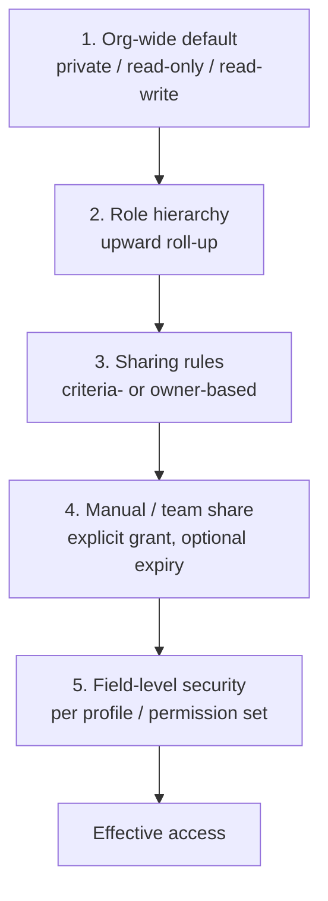

# RBAC and sharing model

Detailed specification of authorization, extending [FRD §7 (SEC)](03-frd.md#7-sec--authorization-sharing-and-segregation-of-duties). Persistence is defined in [the data model](09-data-model.md) §3.3.

## 1. Model layers

Access to a record is the result of five independent layers evaluated together. **Every layer is additive from a private baseline** — nothing narrows access below the org-wide default except lowering that default itself.

Object-level and record-level access (layers 1–4) determine *whether* a record is visible at all. Field-level security (layer 5) then determines *what of it* is visible. A user may see a record exists and still not see half its fields.

## 2. Profiles and permission sets

| Concept | Cardinality | Determines |
|---|---|---|
| **Profile** | Exactly one per user | Baseline object permissions (create/read/edit/delete/view-all/modify-all), baseline field permissions, system permissions |
| **Permission set** | Many per user | Additive object and field permissions on top of the profile |
| **Permission set group** | Many per user | A named bundle of permission sets, with the ability to **mute** specific permissions within the bundle |

**Effective permission = profile ∪ (assigned permission sets) − explicit mutes.** Union, never intersection — a permission granted by any assignment is held, unless a permission set group explicitly mutes it for that bundle.

**Why profile and role are separate, deliberately.** A profile answers *what can this user do*; a role answers *whose records can this user see*. Conflating them — as several products do by convention rather than design — makes it impossible to give someone broad functional permission without also making them a data-visibility hub, or vice versa. Kept separate, a user can be a highly privileged admin functionally while seeing only their own book of business, or a read-only auditor who sees everything.

## 3. Role hierarchy and sharing

### 3.1 Role hierarchy

A directed acyclic structure. Access rolls **upward**: a role inherits read (and, per object configuration, read-write) access to records owned by roles beneath it. This is configurable per object — some objects (e.g. `CASE_RECORD`) may not roll up at all, so a manager does not automatically see every support ticket their team touches.

**Cycle prevention is a save-time constraint**, not a UI convenience — `FR-SEC-001` requires it enforced regardless of entry point (UI, API, bulk import).

### 3.2 Org-wide defaults

Every object has exactly one tenant-level default: `private`, `read-only` or `read-write`. This is the floor. Every other mechanism in this document only ever adds access on top of it.

### 3.3 Sharing rules

| Type | Trigger | Recomputation |
|---|---|---|
| **Criteria-based** | A field value matches a defined condition | On save of the record if the criteria field changed |
| **Owner-based** | Record owner belongs to a defined role, group or territory | On change of owner, or of the role/group/territory's membership |

**Recomputation must never leave stale access served.** If a criteria field changes and recomputation is asynchronous, the record must not be readable under the old grant during the window — `FR-SEC-005`'s determinism requirement means recomputation is either synchronous within the triggering transaction, or the query path checks live criteria rather than trusting a cache that might be behind.

### 3.4 Manual and team sharing

A user with sufficient rights can share an individual record with a user, group or team, optionally with an **expiry** after which the grant lapses automatically without any action (`FR-SEC-006`, `FR-SEC-012`). This is the mechanism for "give my colleague temporary access while I'm out" — the alternative, a permanent share someone has to remember to revoke, is how access sprawl happens in every CRM that lacks it.

### 3.5 Materialization

`RECORD_SHARE` rows are the materialized result of layers 2–4, each carrying a `cause` — owner, role hierarchy, named sharing rule, team, territory, or manual. **This is what makes the access explainer (`FR-SEC-013`, `US-E02-08`) possible without a live recomputation on every query.** A design that evaluates sharing rules at read time instead of materializing them cannot answer "why can this user see this record" without re-deriving the entire calculation, which does not scale to the query volumes an account timeline generates.

## 4. Field-level security

Read and edit are independently configurable per field per profile and permission set.

**Enforcement is uniform across every surface** — UI, API, reports, exports, list views, search results and AI grounding. There is exactly one enforcement point, at serialization, not one per surface (`FR-SEC-007`; [system design](../architecture/system-design.md) §5, "deny-by-default projection at serialization").

**Absence, not null.** A field the user cannot read is omitted from the response entirely. Returning `null` conflates "you can't see this" with "this is empty" — a distinction that matters enormously for a field like `annual_revenue`, where null and hidden mean very different things to a rep sizing an account.

**Sensitive field masking** (`FR-SEC-008`) is a third state beyond read/no-read: a masked field shows a partial value (e.g. last four digits) to holders of read access, with full reveal requiring a separate permission and producing a read-audit event. This exists for fields like a counterparty's account number or a client's tax ID, where "can see it exists and roughly what it is" and "can see the actual value" are legitimately different authorization levels.

## 5. Segregation of duties and maker-checker

### 5.1 Conflicting permission pairs

Administrators declare pairs of permissions that must never be held simultaneously by one user — e.g. "can create a vendor" and "can approve vendor payment", or "can approve a discount" and "can submit the deal it applies to". `SOD_CONFLICT` records these declarations.

**Evaluation happens at three points**, not one: on grant (blocking the grant), on profile change (blocking the change), and on a scheduled sweep (reporting existing violations that predate the conflict's declaration). The third point exists because a conflict declared today may already be violated by grants made last year — those must surface as findings to remediate, not be silently grandfathered in.

### 5.2 Maker-checker

For designated controlled actions (discount approval, permission grants, master data changes, migration execution, tenant termination), the initiator cannot be the approver.

**This constraint applies transitively through delegation** (`FR-SEC-010`) — if approver A delegates to B, and the initiator is B, the approval is still refused. Without transitivity, delegation becomes a trivial bypass: initiate as yourself, delegate the approval to yourself under a different mechanism, approve. The rule has to follow the delegation chain to mean anything.

## 6. Delegated administration

A delegated administrator manages users, roles and configuration only within an assigned branch of the org hierarchy (`FR-SEC-011`). Two properties matter:

1. **Scope is structural, not a permission the delegate could edit.** A delegated admin cannot widen their own branch.
2. **No self-escalation.** A delegated admin cannot grant themselves or anyone a permission outside what they hold — the classic privilege-escalation bug in every homegrown admin-delegation feature is a delegate granting a permission they don't themselves possess.

## 7. Time-bound access and recertification

- **Any** permission or role assignment supports an optional expiry (`FR-SEC-012`). Expiry takes effect without requiring the user to log in again — a session already in progress loses the permission at the expiry moment, not at next authentication.
- **Access recertification campaigns** (`FR-SEC-014`, P2): a reviewer confirms or revokes each grant in scope; anything not confirmed by the deadline is **automatically revoked**, not flagged for later follow-up. Automatic revocation on non-response is what makes a recertification campaign an actual control rather than a compliance exercise nobody finishes.

## 8. Export and print as a distinct permission

The right to export or print is **independently grantable** from the right to read (`FR-SEC-015`). A user can be fully trusted to work with sensitive account data in the product and still be prohibited from taking a copy of it — this is a distinction every audit of a CRM's data-loss controls looks for, and one both Salesforce and Zoho support only partially (see [feature catalogue](04-feature-catalogue.md) F-040).

Export volume above a configured threshold requires approval, and every completed export is audited with actor, object, filter criteria and row count.

## 9. Worked example

A concrete walk-through, because the interaction of five layers is easier to verify against a scenario than a description.

**Setup:** Object-level default for `OPPORTUNITY` is `private`. Sales rep Priya reports to manager Raj in the role hierarchy. A sharing rule grants read-write to the "APAC Deals" territory for opportunities where `region = APAC`. Priya's profile has no `annual_revenue` field access; a permission set granting reveal on masked fields is not assigned to her.

**Opportunity O-4471:** owned by rep Sanjay (not Priya's report), region APAC, `annual_revenue` populated.

- **Layer 1 (org-wide default):** private → Priya has no access by default.
- **Layer 2 (role hierarchy):** Sanjay is not beneath Priya → no access from this layer.
- **Layer 3 (sharing rule):** O-4471 is in APAC → Priya, as an APAC Deals territory member, gets read-write. `RECORD_SHARE` row created with `cause = sharing_rule:apac-deals`.
- **Layer 4 (manual/team):** none present.
- **Result so far:** Priya has read-write access to the record.
- **Layer 5 (field-level security):** `annual_revenue` is not readable on Priya's profile → the field is **absent** from every response she receives, including the record page, any report, and any AI summary grounded on this record.

**If Raj (Priya's manager) queries the same record:** role hierarchy roll-up gives him read access to Priya's records, but O-4471 is owned by Sanjay, not Priya — the roll-up does not reach it through Priya. Raj's access to O-4471, if any, comes from his own territory membership or Sanjay's management chain, evaluated independently.

This is exactly the kind of question the [access explainer](03-frd.md#FR-SEC-013) exists to answer directly, rather than requiring this manual trace.

## 10. Testing implications

Every rule in this document has a corresponding negative test in [the acceptance test catalogue](06-acceptance-tests.md) `SEC-` series: attempted cross-tenant access, attempted field read past a deny, attempted maker-checker bypass via delegation, attempted self-escalation by a delegated admin, and expiry-boundary tests for time-bound grants (access at `expires_at - 1s` vs `expires_at + 1s`).

## Related documents

- [FRD §7](03-frd.md#7-sec--authorization-sharing-and-segregation-of-duties) — the requirements this model satisfies
- [Data model §3.3](09-data-model.md#33-authorization-entities) — persistence
- [System design §5, §9](../architecture/system-design.md) — enforcement architecture and defence in depth
- [Acceptance tests](06-acceptance-tests.md) — `SEC-` series
