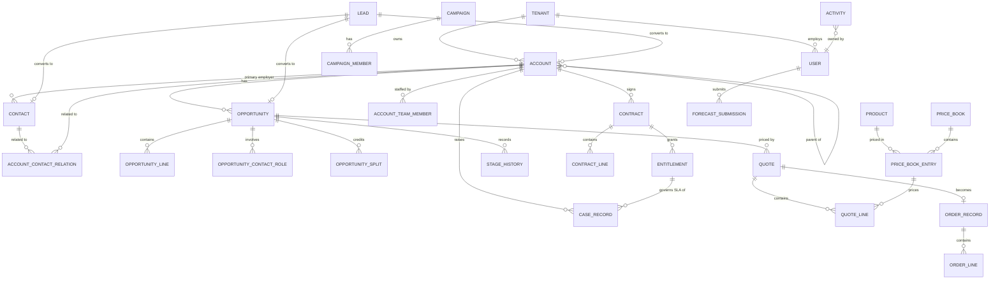

# Logical data model

**Stack-agnostic.** This document describes entities, attributes and relationships as a logical model. It prescribes no database engine, schema syntax or ORM — see [ADR-005](../architecture/adr/ADR-005-technology-selection-deferred.md). Where a physical characteristic is unavoidable (partitioning, indexing, uniqueness), it is stated as a *constraint to be satisfied*, not as an implementation.

---

## 1. Modelling rules

These apply to every entity in this document without exception.

| # | Rule |
|---|---|
| **M1** | Every business entity carries `tenant_id`. It is part of every uniqueness constraint and every index that supports a tenant-scoped query. There is no global business entity. |
| **M2** | Primary keys are opaque, non-sequential and globally unique. Keys must not encode meaning, and must not allow one tenant to infer another's record volume. |
| **M3** | Every mutable entity carries `version` (optimistic lock), `created_at`, `created_by`, `updated_at`, `updated_by`. |
| **M4** | Deletion is soft by default: `deleted_at`, `deleted_by`. Physical deletion occurs only on retention expiry or a data-subject erasure request. |
| **M5** | Every foreign key is tenant-consistent — a reference may never cross tenants. This is enforced by constraint, not by application convention. |
| **M6** | Monetary amounts store transaction currency, transaction amount, corporate amount, applied rate and rate date. A converted amount is never recomputed silently. |
| **M7** | Enumerated business values reference governed reference data. Free-text status columns are not permitted. |
| **M8** | Every entity supporting user extension has a companion custom-value store — see §6. |
| **M9** | Timestamps are stored in UTC with the originating time zone retained where the local time is business-meaningful (meeting times, SLA clocks, market deadlines). |
| **M10** | Quantities store value, unit of measure and, where converted, the conversion factor and its source. |

---

## 2. Core entity map

Activities relate polymorphically to accounts, contacts, leads, opportunities and cases — modelled in §4.6 rather than in the diagram, which would otherwise be unreadable.

---

## 3. Platform entities

### 3.1 TENANT

| Attribute | Type | Notes |
|---|---|---|
| `id` | key | Immutable for the tenant's lifetime |
| `name`, `slug` | text | Slug unique across the platform |
| `status` | enum | `provisioning`, `active`, `suspended`, `terminating`, `terminated` |
| `deployment_model` | enum | `pooled`, `dedicated`, `sovereign` — **the only place deployment appears in the model** |
| `corporate_currency` | ref | |
| `fiscal_calendar_id` | ref | |
| `data_region` | text | Residency commitment |
| `entitlements` | structured | Feature flags and volume limits |
| `retention_policy_id` | ref | |

`deployment_model` exists for operational reporting only. **No business query may branch on it** — see [ADR-001](../architecture/adr/ADR-001-tenancy-isolation.md).

### 3.2 USER

`id`, `tenant_id`, `external_id` (IdP subject), `username`, `email`, `first_name`, `last_name`, `profile_id`, `role_id`, `manager_id`, `business_unit_id`, `locale`, `timezone`, `currency`, `status` (`active`/`inactive`/`locked`), `mfa_enrolled`, `last_login_at`, `license_type`.

- `manager_id` forms the forecast roll-up hierarchy; `role_id` forms the sharing hierarchy. **These are deliberately separate** — the person who approves a forecast is not always the person whose data visibility should encompass it. Conflating them is a common and expensive modelling error.
- Users are never hard-deleted while they own records or appear in audit history (`FR-TEN-007`).

### 3.3 Authorization entities

| Entity | Purpose |
|---|---|
| `PROFILE` | Baseline object and system permissions; exactly one per user |
| `PERMISSION_SET` | Additive grant, many-to-many with users |
| `PERMISSION_SET_GROUP` | Composition of sets, with per-permission mutes |
| `ROLE` | Node in the sharing hierarchy; acyclic, unbounded depth |
| `OBJECT_PERMISSION` | Per profile/set: create, read, edit, delete, view-all, modify-all |
| `FIELD_PERMISSION` | Per profile/set per field: readable, editable |
| `SHARING_RULE` | Criteria- or owner-based grant to role, group or territory |
| `RECORD_SHARE` | Materialized grant: record, grantee, access level, cause, `expires_at` |
| `SOD_CONFLICT` | Declared conflicting permission pair (`FR-SEC-009`) |
| `ACCESS_GRANT_LOG` | Append-only history of every grant and revocation |

`RECORD_SHARE.cause` records *why* access exists — owner, role hierarchy, sharing rule ID, team, territory, manual. This single column is what makes the access explainer (`FR-SEC-013`) possible; retrofitting it later would require recomputing the entire sharing set.

### 3.4 Reference and configuration

`BUSINESS_UNIT`, `CURRENCY`, `EXCHANGE_RATE` (with `effective_from`/`effective_to`), `FISCAL_CALENDAR`, `FISCAL_PERIOD`, `BUSINESS_HOURS`, `HOLIDAY`, `VALUE_SET`, `VALUE_SET_ENTRY` (with `active`, `sort_order`, `effective_from`/`to`), `DEPENDENT_VALUE_MAP`, `TERRITORY`, `TERRITORY_ASSIGNMENT_RULE`, `TERRITORY_MODEL_VERSION`, `QUOTA`.

Reference values are **deactivated, never deleted** (`FR-MDM-006`): historical records must continue to resolve their stored value.

---

## 4. Business entities

### 4.1 ACCOUNT

`id`, `tenant_id`, `name`, `legal_name`, `account_number`, `record_type_id`, `parent_account_id`, `ultimate_parent_id` (derived), `hierarchy_path` (materialized), `owner_id`, `business_unit_id`, `territory_id`, `industry`, `segment`, `employee_count`, `annual_revenue` (money), `website`, `primary_address_id`, `status`, `health_score`, `health_computed_at`, `source_system`, `external_ref`.

- `hierarchy_path` is a materialized ancestor path. Without it, roll-up queries (`FR-ACC-004`) degrade badly on deep hierarchies; with it, the cost moves to write time where it belongs.
- Cycle prevention is a constraint, not a validation: `parent_account_id` may not appear in the record's own `hierarchy_path`.

### 4.2 CONTACT and relationships

**CONTACT** — `id`, `tenant_id`, `account_id`, `first_name`, `last_name`, `title`, `department`, `seniority`, `reports_to_contact_id`, `owner_id`, `email`, `phone`, `mobile`, `mailing_address_id`, `status`, `email_bounced`, `last_engaged_at`, `source_system`, `external_ref`.

**ACCOUNT_CONTACT_RELATION** — `contact_id`, `account_id`, `role`, `influence_level`, `is_active`, `start_date`, `end_date`. Supports one contact at several accounts (`FR-ACC-005`).

**BUYING_GROUP** / **BUYING_GROUP_MEMBER** — group per account or opportunity; members carry `contact_id`, `role` (economic buyer, champion, technical evaluator, blocker, influencer), `influence`, `engagement_status`, `last_engaged_at`.

**CONSENT** — `subject_type`, `subject_id`, `purpose`, `channel`, `state` (granted/withdrawn/never), `lawful_basis`, `source`, `evidence_ref`, `granted_at`, `withdrawn_at`. **Append-only**: a withdrawal is a new row, never an update. Consent history is evidence and must not be destroyed by the act of changing consent.

**ADDRESS** — typed, multiple per account or contact, with `address_type`, geo-coordinates and validation status.

### 4.3 LEAD

`id`, `tenant_id`, `first_name`, `last_name`, `company`, `title`, `email`, `phone`, `status`, `rating`, `source`, `campaign_id`, `owner_id`, `queue_id`, `assigned_at`, `first_response_due_at`, `first_responded_at`, `score`, `score_computed_at`, `predicted_conversion`, `matched_account_id`, `match_confidence`, `qualification_data` (framework fields), `converted_account_id`, `converted_contact_id`, `converted_opportunity_id`, `converted_at`, `disqualification_reason`, `recycle_date`.

`first_response_due_at` is computed against the assigned owner's business hours at assignment time and stored, not derived at read time — the SLA a lead was given must not change retroactively when business hours are edited (`FR-LED-009`).

### 4.4 OPPORTUNITY

`id`, `tenant_id`, `name`, `account_id`, `pipeline_id`, `stage_id`, `record_type_id`, `owner_id`, `business_unit_id`, `territory_id`, `amount` (money), `recurring_amount`, `term_months`, `arr`, `tcv`, `close_date`, `original_close_date`, `slip_count`, `probability`, `forecast_category`, `forecast_category_override`, `override_reason`, `is_closed`, `is_won`, `closed_at`, `close_reason_id`, `won_competitor_id`, `lead_source`, `campaign_id`, `qualification_score`, `risk_flags`, `stage_entered_at`, `last_activity_at`, `next_step`, `partner_account_id`, `deal_registration_id`.

**STAGE_HISTORY** — `opportunity_id`, `from_stage_id`, `to_stage_id`, `entered_at`, `exited_at`, `duration_seconds`, `changed_by`, `reason`, `criteria_version_id`.

`criteria_version_id` pins which version of the stage exit criteria applied. Without it, an in-flight opportunity would be re-judged against criteria that did not exist when it entered the stage (`FR-OPP-003`).

**OPPORTUNITY_LINE** — `product_id`, `price_book_entry_id`, `quantity`, `unit_of_measure`, `list_price`, `sale_price`, `discount_pct`, `total`, `total_is_overridden`, `computed_total`, `cost`, `margin`.

Both `total` and `computed_total` are stored (`FR-OPP-005`): an override must not destroy the evidence of what the system calculated.

**OPPORTUNITY_SPLIT** — `user_id`, `split_type` (`revenue`/`overlay`), `percentage`, `amount`. Revenue splits must total 100%; overlay splits are unconstrained.

**OPPORTUNITY_CONTACT_ROLE** — `contact_id`, `role`, `is_primary`.

### 4.5 Pipeline configuration

**PIPELINE** → **PIPELINE_STAGE** (`sort_order`, `probability`, `forecast_category`, `is_closed`, `is_won`, `allows_backward`, `allows_skip`) → **STAGE_EXIT_CRITERION** (`criterion_type`, `expression`, `message`, `version`, `effective_from`).

Criteria are versioned, never edited in place.

### 4.6 ACTIVITY

A single `ACTIVITY` entity with `activity_type` (`task`/`event`/`call`/`email`/`note`), rather than separate tables per type. The unified timeline (`FR-ACT-004`) is the dominant read pattern and it is a single-table scan under this model; separate tables would make it a five-way union on every record page.

`id`, `tenant_id`, `activity_type`, `subject`, `body`, `owner_id`, `status`, `priority`, `due_at`, `start_at`, `end_at`, `completed_at`, `duration_seconds`, `direction`, `disposition_id`, `outcome`, `capture_source` (`manual`/`auto`/`api`/`ai`), `match_confidence`, `is_private`, `thread_id`, `external_message_id`, `recording_ref`, `transcript_ref`.

**ACTIVITY_RELATION** — `activity_id`, `related_type`, `related_id`, `relation_role`. Many-to-many: one email legitimately relates to a contact, an account and two opportunities at once. Modelling this as a single nullable `related_to_id` is a mistake that is very expensive to undo later.

**ACTIVITY_PARTICIPANT** — `activity_id`, `participant_type` (`user`/`contact`/`lead`/`external`), `participant_id`, `email`, `response_status`.

`is_private` items are **never stored** where the user has excluded them (`FR-ACT-007`); the flag covers items captured before an exclusion rule was applied, which are then purged.

### 4.7 Product, pricing and quoting

**PRODUCT** — `code`, `name`, `family`, `category`, `is_active`, `is_bundle`, `unit_of_measure`, `attributes`, `lifecycle_start`, `lifecycle_end`.
**PRODUCT_BUNDLE_COMPONENT** — `bundle_product_id`, `component_product_id`, `is_required`, `min_qty`, `max_qty`, `default_qty`.
**CONFIGURATION_RULE** — `rule_type` (`include`/`exclude`/`require`/`validate`), `condition_expression`, `message`.
**PRICE_BOOK** — `name`, `currency`, `business_unit_id`, `segment`, `is_active`.
**PRICE_BOOK_ENTRY** — `price_book_id`, `product_id`, `unit_price`, `effective_from`, `effective_to`, `is_active`.
> Constraint: no two active entries for the same `(price_book_id, product_id)` may have overlapping effective ranges (`FR-CPQ-002`).

**PRICING_RULE** — tiered, volume, block, percent-of-total, attribute-based; with `priority` and `condition_expression`.
**CONTRACTED_PRICE** — `account_id`, `product_id`, `price`, `effective_from`, `effective_to`.
**QUOTE** — `opportunity_id`, `account_id`, `contact_id`, `version_number`, `is_active_version`, `status`, `expires_at`, `subtotal`, `discount_total`, `tax_total`, `grand_total`, `margin_pct`, `approval_status`, `document_ref`, `esign_envelope_id`, `esign_status`, `accepted_at`.
**QUOTE_LINE** — as `OPPORTUNITY_LINE`, plus `bundle_parent_line_id`, `pricing_method_applied`, `price_adjustments` (itemized, so the final price is fully derivable per `FR-CPQ-007`).

### 4.8 Contract, order, subscription

**CONTRACT** — `account_id`, `contract_number`, `version_number`, `status`, `start_date`, `end_date`, `term_months`, `auto_renew`, `notice_period_days`, `total_value`, `owner_id`, `signed_at`, `document_ref`, `supersedes_contract_id`, `change_reason`.

Amendment creates a **new version row** linked by `supersedes_contract_id` (`FR-CTR-003`). Prior versions are immutable, which is what makes as-of-date reporting possible.

**CONTRACT_LINE**, **ORDER_RECORD** (`erp_handoff_status`, `erp_ref`, `handoff_attempts`, `last_handoff_error`), **ORDER_LINE**, **SUBSCRIPTION** (`status`, `billing_frequency`, `quantity`, `mrr`, `arr`, `next_renewal_date`, `churn_reason_id`), **ASSET** (installed base), **ENTITLEMENT** (`support_level`, `business_hours_id`, `response_target_minutes`, `resolution_target_minutes`, `covered_products`, `valid_from`, `valid_to`).

### 4.9 Forecasting

**FORECAST_SUBMISSION** — `user_id`, `fiscal_period_id`, `forecast_type`, `rollup_amount`, `submitted_amount`, `override_reason`, `submitted_at`, `is_locked`, `snapshot_id`.
**FORECAST_SNAPSHOT** / **FORECAST_SNAPSHOT_LINE** — the full contributing opportunity detail as at submission: `opportunity_id`, `amount`, `stage_id`, `forecast_category`, `close_date`, `probability`.

Storing snapshot **lines**, not just totals, is what makes `FR-FCT-005` (decompose any forecast to its source deals) and `FR-FCT-006` (movement waterfall) possible. A snapshot that stores only a total cannot answer "why did commit fall by 400k" — the single most-asked question in a forecast review.

**PIPELINE_SNAPSHOT** — scheduled point-in-time capture supporting historical trending (`FR-RPT-008`).

### 4.10 Case and service

**CASE_RECORD** — `case_number`, `account_id`, `contact_id`, `asset_id`, `entitlement_id`, `type`, `priority`, `severity`, `status`, `origin`, `subject`, `description`, `owner_id`, `queue_id`, `parent_case_id`, `response_due_at`, `resolution_due_at`, `first_responded_at`, `resolved_at`, `closed_at`, `resolution`, `csat_score`, `is_sla_breached`.
**SLA_CLOCK_EVENT** — `case_id`, `event` (`start`/`pause`/`resume`/`stop`), `at`, `reason`, `actor_id`, `elapsed_seconds_at_event`. Append-only; the SLA position is always reconstructible rather than asserted (`FR-CAS-004`).
**KNOWLEDGE_ARTICLE** — versioned with `publication_status` and `audience_visibility`.

### 4.11 Campaign

**CAMPAIGN** (`parent_campaign_id`, `type`, `status`, `start_date`, `end_date`, `budgeted_cost`, `actual_cost`, `expected_revenue`), **CAMPAIGN_MEMBER** (`member_type`, `member_id`, `status`, `first_responded_at`), **ATTRIBUTION_TOUCH** (`opportunity_id`, `campaign_id`, `touch_type`, `touched_at`, `model_id`, `attributed_amount`, `model_version`).

Attribution is stored per model and per version (`FR-CMP-005`) so that first-touch, last-touch and multi-touch can be shown side by side without recomputation, and so a historical figure remains reproducible after the model changes.

### 4.12 Partner

**PARTNER_ACCOUNT** (extension of `ACCOUNT`), **DEAL_REGISTRATION** (`partner_account_id`, `account_name`, `status`, `submitted_at`, `approved_at`, `expires_at`, `protection_level`, `linked_opportunity_id`), **CHANNEL_CONFLICT** (`registration_id`, `conflicting_record_id`, `detected_at`, `resolution`, `resolved_by`).

---

## 5. Vertical pack entities

Pack entities live in their own namespace, reference core entities, and are removable as a unit (`FR-BFS-013`). **A pack may add entities and add fields; it may not alter core semantics.**

### 5.1 BFSI pack (E22)

`RM_BOOK`, `HOUSEHOLD`, `HOUSEHOLD_MEMBER`, `KYC_CASE` (`risk_tier`, `status`, `activated_at`), `KYC_DOCUMENT` (`doc_type`, `received_at`, `expires_at`, `verification_status`, `verified_by`), `RISK_RATING` (`factors`, `computed_score`, `tier`, `rationale`, `rated_by`, `rated_at`), `SCREENING_RUN` / `SCREENING_HIT` (`hit_type`, `match_score`, `disposition`, `dispositioned_by`, `rationale`), `BENEFICIAL_OWNER`, `PRODUCT_HOLDING`, `SUITABILITY_ASSESSMENT` (`objectives`, `risk_tolerance`, `horizon`, `knowledge_level`, `assessed_at`, `valid_until`), `SUITABILITY_OVERRIDE` (`reason`, `approved_by`), `COMMUNICATION_ARCHIVE` (immutable, `legal_hold`), `COMPLAINT`.

### 5.2 Commodity trading pack (E23)

`COUNTERPARTY_PROFILE` (extends `ACCOUNT`: `legal_entities`, `approved_commodities`, `approved_venues`, `ctrm_ref`, `is_ctrm_mastered`), `MASTER_AGREEMENT` (`agreement_type`, `counterparty_entity`, `executed_at`, `governing_law`, `status`, `expires_at`), `CREDIT_SNAPSHOT` (`counterparty_id`, `limit`, `utilised`, `headroom`, `currency`, `as_of`, `source_system`, `is_stale`), `ORIGINATION` (extends `OPPORTUNITY`: `origination_type`, `commodity_id`, `grade_id`, `quantity`, `tolerance_pct`, `unit_of_measure`, `delivery_window_start/end`, `load_location_id`, `discharge_location_id`, `incoterm`), `TENDER` (`issuing_body`, `tender_ref`, `submission_deadline`, `documents_required`, `submitted_at`, `award_outcome`, `awarded_counterparty`, `awarded_price`), `PRICING_INDICATION` (`basis` fixed/formula, `index_id`, `differential`, `quotation_period`, `settlement_convention`, `expression_text`, `is_indicative`), `INTERMEDIARY` (`role`, `commission_basis`), `DEAL_HANDOFF` (`origination_id`, `payload`, `status`, `attempts`, `acknowledged_at`, `ctrm_trade_ref`, `last_error`), `COMMODITY`, `GRADE`, `LOCATION`, `UOM_CONVERSION`.

**`CREDIT_SNAPSHOT` is a cache, not a source.** It carries `as_of`, `source_system` and `is_stale` precisely so the CRM can never present credit headroom as its own fact. `is_stale` drives the fail-closed behaviour in `FR-CTM-003`. There is deliberately **no exposure, position, valuation or settlement entity anywhere in this model** — that boundary is the whole point of the pack.

---

## 6. Extensibility model

Custom objects and fields must behave identically to standard ones — in security, automation, reporting, search and API (`FR-ADM-001`, `FR-ADM-002`). Three approaches exist and only one is acceptable.

| Approach | Verdict |
|---|---|
| Pure EAV (row per field value) | **Rejected.** Every query becomes a self-join per field; reporting and sorting degrade non-linearly; type safety is lost |
| DDL per tenant (real columns) | **Rejected for pooled tenancy.** Schema count explodes with tenant count; migrations become O(tenants); a shared-schema model cannot support it |
| **Typed sparse columns + metadata catalogue** | **Adopted** |

**Adopted design.** Each extensible entity has a fixed set of reserved, indexable, typed slots per data type (text, number, date, datetime, boolean, reference). A metadata catalogue maps a tenant's logical field to a physical slot.

- `CUSTOM_OBJECT_DEF` — `tenant_id`, `api_name`, `label`, `plural_label`, `record_name_format`
- `CUSTOM_FIELD_DEF` — `tenant_id`, `entity`, `api_name`, `label`, `data_type`, `slot`, `is_required`, `is_unique`, `default_value`, `help_text`, `reference_target`, `formula_expression`
- `CUSTOM_RECORD` / `CUSTOM_RECORD_VALUES` — instances of custom objects, using the same slot mechanism
- `PICKLIST_DEF`, `RECORD_TYPE_DEF`, `LAYOUT_DEF`, `VALIDATION_RULE_DEF`, `LIST_VIEW_DEF`

**Why this works:** slots are real typed columns, so they index, sort, filter and aggregate at native speed. **Why it is bounded:** slot count per type is finite. Slot exhaustion must produce a clear administrator message and a documented expansion path — never a silent failure or an opaque error.

This is an honest trade. `FR-ADM-001` promises no *tier-based* limit on custom objects, and this design honours that. It does not promise infinity, and the documentation must not imply it. The expansion path (additional slot ranges provisioned per tenant) is an operational task, not a product limit.

**Formula and roll-up fields** are stored as definitions plus a materialized value with `computed_at`, recomputed on dependency change. Dependency cycles are rejected at definition time, naming the cycle.

---

## 7. Audit and history

| Entity | Content |
|---|---|
| `AUDIT_EVENT` | `tenant_id`, `occurred_at`, `actor_id`, `impersonator_id`, `action`, `entity_type`, `entity_id`, `source` (ui/api/automation/ai/migration), `reason`, `correlation_id`, `ip`, `user_agent`, `sequence_no`, `prev_hash`, `hash` |
| `FIELD_HISTORY` | `entity_type`, `entity_id`, `field`, `old_value`, `new_value`, `changed_at`, `changed_by` |
| `READ_AUDIT` | Sensitive-object view events (`FR-AUD-003`) |
| `EXPORT_AUDIT` | `actor_id`, `object`, `filter_criteria`, `row_count`, `destination`, `at` |
| `SETUP_AUDIT` | Configuration changes with before/after |
| `AI_INTERACTION` | `prompt_ref`, `grounding_record_ids`, `model`, `masking_policy_applied`, `output_ref`, `accepted_by_user`, `latency_ms`, `cost` |

`prev_hash`/`hash` chain each tenant's audit stream, giving tamper evidence (`FR-AUD-007`). `sequence_no` is monotonic per tenant, so a gap is detectable — deletion of an event is visible even if the event itself is gone.

**Audit is append-only at the storage level, not merely by convention.** No application role, including platform operator, may hold update or delete rights on these entities (`FR-AUD-001`).

`AI_INTERACTION.grounding_record_ids` is what makes citation (`FR-AIX-007`) auditable after the fact rather than merely displayed at the time.

---

## 8. Data volume and performance constraints

Targets are stated in [the NFR document](10-nfr-and-enterprise-readiness.md); the model must satisfy them.

| Concern | Constraint |
|---|---|
| **Tenant-scoped access** | Every index supporting a business query is prefixed by `tenant_id`. A query plan that scans across tenants is a defect, not a slow query |
| **Large-tenant skew** | Tenant sizes vary by orders of magnitude. The largest tenant's volume must not degrade the smallest tenant's latency — partitioning or equivalent isolation is required for the high-volume entities |
| **High-volume entities** | `ACTIVITY`, `ACTIVITY_RELATION`, `AUDIT_EVENT`, `FIELD_HISTORY`, `RECORD_SHARE`, `PIPELINE_SNAPSHOT` — these dominate storage and must be partitioned by tenant and time |
| **`RECORD_SHARE` growth** | Materialized sharing grows super-linearly with users × records. Recomputation on role or rule change must be incremental and asynchronous, with progress visible; a full rebuild must never block business writes |
| **Timeline query** | Account timeline must be served by an index on `(tenant_id, related_id, occurred_at desc)`; it is the single most-executed query in the product |
| **Reporting** | Analytical queries must not contend with transactional writes. A read-optimized projection is required — see [system design](../architecture/system-design.md) |
| **Soft-delete filtering** | `deleted_at IS NULL` participates in every business index. Omitting it makes every query read tombstones |
| **Hierarchy traversal** | Account and role hierarchies are traversed via materialized paths, not recursive queries at read time |

---

## 9. Data lifecycle

| Stage | Behaviour |
|---|---|
| **Create** | Validation, duplicate detection, tenant stamping, audit event |
| **Update** | Optimistic version check, field-history capture, audit event |
| **Soft delete** | `deleted_at` set; record leaves all business queries; remains restorable (`FR-ADM-011`) |
| **Restore** | Relationships restored intact; audited |
| **Archive** | Moved out of the active working set, remains queryable and reportable (`FR-ADM-012`) |
| **Retention expiry** | Physical deletion per policy, with legal hold as an absolute override |
| **Erasure (DSR)** | Personal data removed or irreversibly pseudonymized across all stores, **including AI caches and embeddings**; a non-personal audit record that erasure occurred is retained (`FR-AUD-008`) |
| **Export** | Complete tenant export with manifest and checksums (`FR-AUD-013`) |

**Erasure is the hardest of these to retrofit.** Every derived or cached store — search index, reporting projection, AI embedding store, snapshot tables — must be enumerable and reachable by the erasure process from day one. A store that cannot be reached must be reported as unreachable rather than skipped, per `FR-AUD-008`.

---

## Related documents

- [FRD](03-frd.md) — the requirements this model satisfies
- [RBAC and sharing model](08-rbac-and-sharing-model.md) — how `RECORD_SHARE` is populated and evaluated
- [Non-functional requirements](10-nfr-and-enterprise-readiness.md) — the volume and latency targets
- [System design](../architecture/system-design.md) · [ADR-001 tenancy](../architecture/adr/ADR-001-tenancy-isolation.md) · [ADR-002 extensibility](../architecture/adr/ADR-002-extensibility-model.md)
- [BFSI pack](12-vertical-pack-bfsi.md) · [Commodity trading pack](17-vertical-pack-commodity-trading.md)
