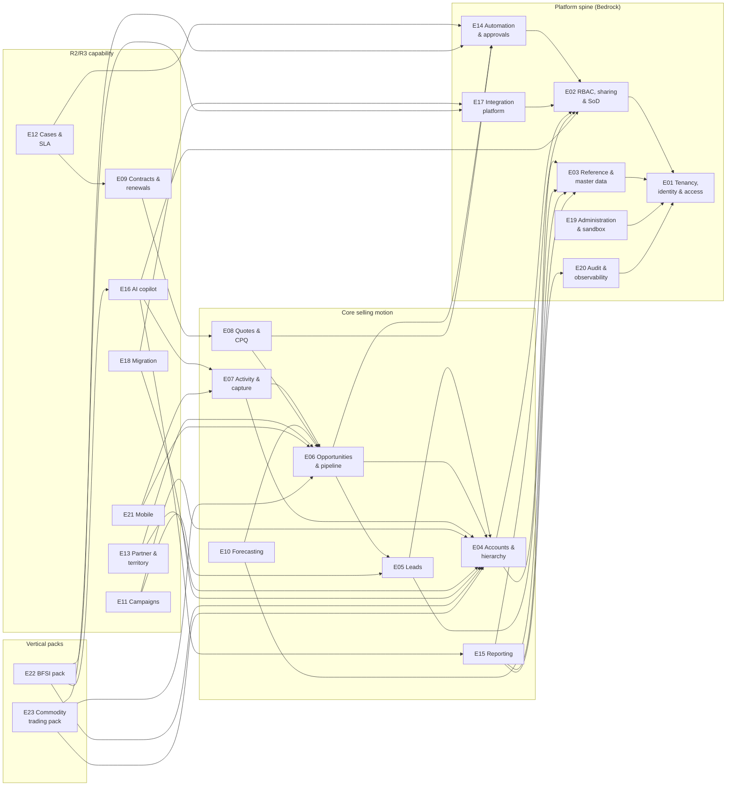

# Agile delivery plan

**Product:** Axiom — Enterprise B2B CRM
**Status:** Planning baseline — velocities are assumptions until measured
**Date:** 2026-07-25

How 23 epics, 183 stories and 1,352 points ([epics and stories](05-epics-and-stories.md)) become a sequence of shippable releases. This plan is honest about the two numbers that dominate it: **43% of P0 requirements are platform and governance work** that delivers no directly visible sales capability ([FRD §31](03-frd.md#31-traceability-matrix)), and **the velocity this plan assumes has never been measured on this team building this product**. Both are stated as planning inputs, not buried as footnotes.

---

## 1. Team shape

**Three squads: two feature squads and one platform squad.** The split is a direct response to the FRD traceability finding — if platform work is 43% of P0, then roughly a third of delivery capacity belongs to it permanently, staffed as a first-class squad rather than scavenged from feature teams "when there's time". There is never time.

| Squad | Mission | Composition | Size |
|---|---|---|---|
| **Platform squad — "Bedrock"** | Owns the platform modules: tenancy and identity (E01), RBAC and sharing (E02), reference data (E03), automation engine (E14), audit and observability (E20), and the platform half of administration (E19). Later: integration platform (E17) foundations. | 1 PO (platform), 6 engineers (incl. tech lead), 1 QA, 1 DevOps/SRE | 9 |
| **Feature squad — "Pipeline"** | Owns the selling motion: leads (E05), opportunities (E06), forecasting (E10), quotes/CPQ (E08). | 1 PO, 5 engineers (incl. tech lead), 1 QA | 7 |
| **Feature squad — "Accounts"** | Owns the customer record and its surfaces: accounts/contacts (E04), activities (E07), the admin configuration UI (E19 surfaces), reporting (E15), migration (E18). | 1 PO, 5 engineers (incl. tech lead), 1 QA | 7 |
| **Shared across squads** | 2 Scrum Masters (each serving 1–2 squads), 1 architect (owns ADR ratification calendar), 2 product/UX designers, 1 AI engineer (joins full-time when E16 work starts, advises before), 1 technical writer | 7 |

**Total: ~30 people.** Notes on the shape:

- **QA is embedded, not a phase.** Each squad's QA engineer writes and automates the [acceptance test catalogue](06-acceptance-tests.md) cases for that squad's stories inside the sprint. There is no downstream test team to throw builds over a wall to.
- **POs are per-squad; the product lead arbitrates across them.** The platform PO is a real product role, not a proxy engineer — platform work has users (administrators, auditors, integration developers) and needs the same outcome discipline as feature work.
- **Scrum Masters are shared 1:1.5** because three mature squads do not need three full-time SMs, and because the SM's highest-value work here is cross-squad: dependency management between Bedrock and the feature squads.
- **The AI engineer is named explicitly** because E16 is the largest epic in the backlog (89 points) and its evaluation-harness work (US-E16-10) is a specialist skill. Discovering in R2 that nobody on staff can build an eval suite is an avoidable failure.

## 2. Cadence

- **Sprint length: 2 weeks**, all squads synchronized on the same boundaries.
- **Release trains** ship from a shared hardening sprint at each train boundary — see §5.
- The [Definition of Ready and Definition of Done in the backlog document](05-epics-and-stories.md#definition-of-ready) apply to every story without exception. They are not restated here; a delivery plan that duplicates its DoD invites the two copies to drift.

## 3. Velocity — an assumption, and the honest math

**Assumption: 40–50 points per squad per sprint** once ramped, i.e. **120–150 points per sprint across three squads**. This number is a planning assumption derived from comparable teams on the sibling Octane platform. It has not been measured for this team on this product, and the plan treats it accordingly: **the baseline is re-cut against actuals after sprint 3, and every date below is a range, not a commitment.**

The naive math:

| | At 50 pts/squad | At 40 pts/squad |
|---|---:|---:|
| Points per sprint (3 squads) | 150 | 120 |
| Sprints for 1,352 points | 9.0 | 11.3 |
| Elapsed time | ~4.5 months | ~5.5 months |

**The naive math is wrong, and it is worth being precise about why:**

1. **Ramp.** Sprints 1–2 run at roughly half velocity: new codebase, new domain, environments and CI still being built. Cost: ~1.5 sprints of capacity.
2. **Unpointed enabler work.** Walking skeleton, CI/CD, environment builds, performance rigs, and the six open architecture decisions (system design §15 — cache by sprint 3, broker by sprint 4, search by sprint 6) are real engineering that carries no story points. This is where most of the 43% platform tax that isn't already in E01/E02/E14/E19/E20 story points actually lands.
3. **Load factor.** Committing 100% of nominal velocity to backlog stories leaves nothing for defects, integration friction and review findings. Plan ~70% of velocity to stories; the rest is consumed, every sprint, whether planned or not.
4. **Hardening.** Each release train ends with a hardening/UAT sprint (regression, performance validation, accessibility audit, [UAT plan](07-uat-plan.md) execution). Four trains → 4 sprints.
5. **Dependency serialization.** Feature squads cannot outrun the platform spine (§6). Some feature capacity in early sprints is structurally underused regardless of team quality.

Adjusted: 1,352 points ÷ (135 × 0.7) ≈ 14.3 working sprints, + ~1.5 sprints ramp + 4 hardening sprints ≈ **20–22 sprints ≈ 10–11 months** for the complete catalogue, with the first production release (R1) at **sprint 8, roughly month 4**. If measured velocity comes in at the bottom of the band, R1 moves to sprint 9–10 and the full plan to ~13 months. **Either the timeline holds, the team grows, or the P0 line moves — the [feature catalogue](04-feature-catalogue.md) said this plan had to confront that choice, and this is where it is confronted: the mid-R1 checkpoint (end of sprint 4) re-cuts the plan against actuals and forces the choice explicitly if the band is missed.**

## 4. The 43% platform-work warning, addressed head-on

The [FRD traceability matrix](03-frd.md#31-traceability-matrix) is blunt: `TEN`, `SEC`, `AUT`, `ADM`, `AIX` and `AUD` account for 66 of 154 P0 requirements — **43% of the first release is platform and governance work that no sales rep will ever see**. The delivery failure mode this produces is well known: feature squads sprint ahead on visible capability, discover in sprint 6 that sharing, audit and automation don't exist, and the plan collapses into a serialized platform rebuild while stakeholders ask why velocity died.

This plan's response:

1. **A permanent platform squad holding ~⅓ of capacity** (§1). Platform work is never "borrowed against".
2. **Bedrock runs one to two sprints ahead of the feature squads on the dependency spine.** Tenancy and authentication land in sprints 1–2 before any feature story needs them; the sharing model (US-E02-03) lands in sprint 4 before the pipeline board and reporting depend on it; the automation engine lands in sprints 6–7 before quotes and SLA work in R2 consume approvals. Feature squads build against **published module interfaces with stubs** where the real implementation is still landing — a DoR requirement (dependencies "satisfied or explicitly stubbed").
3. **Platform stories are demoed through feature-visible scenarios.** Sprint reviews show "a rep in tenant A cannot see tenant B's pipeline, and here is the audit event that recorded the attempt" — not a slide about RLS. This keeps stakeholders funding the 43% because they can see what it buys.
4. **Every story pays its own platform tax.** The DoD already forces tenancy, authorization, audit, API coverage and reporting projection into every story. The platform squad builds the rails; it does not absorb other squads' obligations to use them.

## 5. Release trains

| Train | Sprints | Theme | Epic scope |
|---|---|---|---|
| **R1** | 1–8 (incl. hardening) | **Core platform + lead-to-opportunity.** A tenant can be provisioned, secured, and configured; leads flow to opportunities through an enforced pipeline; everything is audited. | E01, E02, E03 (partial — P0 stories), E04, E05, E06, E14 (partial — engine, approvals, expression language; visual builder moves to R2), E19 (partial — custom objects/fields, layouts, setup audit, import, mass ops), E20 (partial — immutable audit, field history, export/read audit, observability) |
| **R2** | 9–14 (incl. hardening) | **Complete P0 — the first full production release.** Everything the FRD marks P0 is done. | E08 (quotes/CPQ P0), E10 (forecasting P0), E07 (activity and capture P0), E15 (reporting P0), E16 (AI P0 slice: summarization, permission-scoped grounding, next-best-action, drafting, conversational query, score decomposition, PII masking, AI-off), E17 (API platform), E18 (migration importers), E14/E19/E20/E21 P0 completion (visual builder, sandbox, promotion, DSR/consent/tenant export, responsive UI) |
| **R3** | 15–19 (incl. hardening) | **P1 depth.** | E09 (contracts/renewals), E11 (campaigns), E12 (cases/SLA P1), E07 P1 (cadences, engagement, telephony), E16 P1 (agentic execution, forecast prediction, eval harness), E21 (native mobile apps), E10/E03/E02/E15/E17/E18 P1 remainder |
| **R4** | 20–22+ (incl. hardening) | **Vertical packs and the long tail.** | E22 (BFSI pack), E23 (commodity trading pack), E13 (partner/channel), P2 items (offline sync, knowledge, portal, access reviews, territory realignment) |

Sequencing rationale worth recording: **both vertical packs are entirely P1/P2 and deliberately last** — the pack framework (US-E22-01) has to be proven against a stable core before an industry vertical is worth building on it, per the [FRD](03-frd.md#31-traceability-matrix). And **E16's P0 slice ships in R2, not R1**, because permission-scoped grounding (US-E16-02) is only testable once the sharing model it must respect (US-E02-03, R1) is real.

## 6. Epic dependency graph

Arrows read "depends on". The platform spine (left) is why Bedrock runs ahead.

Two edges deserve comment because they are easy to miss:

- **E16 → E02.** The AI copilot's defining control — grounding retrieval under the calling user's permissions — cannot be built, or even honestly tested, before the sharing model exists. Any plan that puts AI before RBAC is building the privileged-retrieval backdoor the [system design §10](../architecture/system-design.md#10-ai-architecture) prohibits.
- **E12 → E09.** Entitlement-driven SLA needs entitlements, which come from contracts. Cases before contracts means default SLAs only, which US-E12-03 explicitly treats as the flagged-uncovered exception path, not the product.

## 7. R1 sprint-by-sprint allocation

The planning baseline for the first train. Story IDs and points are from [the backlog](05-epics-and-stories.md); squads own the final cut at each sprint planning, and unallocated capacity (the gap between these commitments and nominal velocity) deliberately absorbs enablers, spikes, defects and the architecture-decision calendar — per the load-factor math in §3.

| Sprint | Bedrock (platform) | Pipeline squad | Accounts squad | Exit milestone |
|---|---|---|---|---|
| **S1** *(ramp)* | US-E01-01 (5), US-E01-02 (5) · enablers: walking skeleton, CI/CD, environments, RLS + outbox proof-of-shape | US-E05-01 (5), US-E05-02 (5) | US-E04-01 (5), US-E04-02 (8) | A tenant-scoped request travels edge→API→RLS-enforced database in every environment |
| **S2** *(ramp)* | US-E01-03 (8), US-E01-04 (5), US-E02-01 (8), US-E20-09 (5) | US-E05-03 (8), US-E05-04 (8), US-E05-08 (3) | US-E04-05 (8), US-E04-03 (8) | SSO sign-in demo; leads scored, routed, and explained |
| **S3** | US-E01-05 (8), US-E01-06 (8), US-E02-02 (8), US-E20-01 (8) · cache decision (Q, ADR-005) | US-E05-05 (5), US-E05-07 (8), US-E06-01 (8), US-E06-04 (8) | US-E04-06 (8), US-E04-07 (8), US-E04-08 (8) | Lead → account/contact/opportunity conversion end to end; immutable audit live |
| **S4** | US-E02-03 (13), US-E01-07 (5), US-E01-08 (5), US-E20-02 (5) · broker ratification (Q5) | US-E06-02 (13), US-E06-03 (3), US-E06-07 (5) | US-E19-01 (13), US-E19-02 (3), US-E03-04 (5) | Sharing model live; stage gating enforced identically via UI, board, API and bulk · **mid-R1 checkpoint: re-baseline velocity** |
| **S5** | US-E02-04 (8), US-E02-05 (5), US-E02-06 (8), US-E02-07 (8), US-E03-01 (8) | US-E06-06 (8), US-E06-08 (5), US-E06-09 (8) | US-E19-03 (8), US-E19-06 (5), US-E03-02 (5), US-E03-03 (5) | Field-level security, masking, SoD and maker-checker enforced; pipeline board demo |
| **S6** | US-E14-01 (13), US-E14-05 (8), US-E14-07 (8), US-E01-09 (8), US-E02-09 (5) · search decision (Q4) | Notification centre MVP ([notifications spec](18-notifications-and-alerting.md) P0 slice) · cross-squad integration hardening | US-E19-07 (8), US-E19-08 (8), US-E19-09 (5) | Automation engine live with execution log; in-app notifications delivering |
| **S7** | US-E14-02 (13), US-E14-04 (13), US-E14-08 (8), US-E14-09 (3) | Approval flows integrated into lead/opportunity surfaces; speed-to-lead escalation wiring; defect burn-down | US-E20-03 (5) · R1 UAT preparation, import/mass-op polish | Enforced process + approvals live · **R1 feature freeze** |
| **S8** *(hardening)* | Performance validation: RLS overhead and sharing recompute against the 10M-record rig; failure-mode drills | Full regression of [acceptance test catalogue](06-acceptance-tests.md) R1 cases; accessibility audit | [UAT plan](07-uat-plan.md) execution with P0 personas; release readiness review | **R1 GA** |

R1 planned story load is ~440 points against ~610 points of load-factored capacity across eight sprints — the difference is the deliberate slack of §3 items 2–3, and if that slack turns out to be needed for stories instead, that is the sprint-4 checkpoint's problem to surface, not sprint 8's.

R2–R4 are planned at epic granularity only (§5); cutting them to stories now would be fiction, and re-cutting them after R1 actuals is the point of having trains.

## 8. Ceremonies

| Ceremony | Cadence | Who | Notes |
|---|---|---|---|
| Sprint planning | First day of sprint, ≤ 3h | Per squad | Stories must satisfy [DoR](05-epics-and-stories.md#definition-of-ready) before entering — planning is not the place to discover a missing interface contract |
| Daily scrum | Daily, 15 min | Per squad | |
| Backlog refinement | Weekly, 1h | Per squad + architect as needed | Two sprints of DoR-ready runway is the health metric |
| Scrum of scrums | Twice weekly, 15 min | SMs + tech leads | The dependency-spine early-warning system; a feature squad blocked on Bedrock for more than a day surfaces here |
| Sprint review | Last day of sprint, joint | All squads + stakeholders | One review, not three — platform work demos through feature-visible scenarios (§4) |
| Retrospective | Last day of sprint | Per squad; cross-squad every 6 sprints | |
| Release train planning | 1 day at each train boundary | Everyone | Re-cut the next train against measured velocity; ratify pending ADRs due in that train |
| Risk review | Monthly | POs, SMs, architect, product lead | Walks the register below; a risk with a stale mitigation is escalated, not re-noted |

## 9. Risk register

Real risks with owners and mitigations — not a compliance table. Reviewed monthly (§8).

| # | Risk | L | I | Mitigation | Early signal |
|---|---|:--:|:--:|---|---|
| R-01 | **RLS performance at scale.** Per-row policy evaluation on partitioned high-volume tables (activity, audit, shares) degrades the p95 latency budgets in [the NFR doc](10-nfr-and-enterprise-readiness.md) | M | H | Performance rig with 10M-record tenants from sprint 2; tenant-leading composite indexes; benchmark gates in CI; RLS overhead measured per release, not assumed | p95 record-read > 200 ms on the rig |
| R-02 | **Sharing recompute at scale.** US-E02-03 demands "stale access is never served" — blocking semantics during recompute of owner/criteria sharing on large tenants could stall reads | M | H | Materialized share tables ([RBAC model §3.5](08-rbac-and-sharing-model.md)) with scoped, incremental recompute; recompute benchmarked on the rig before R1 GA; explicit product decision on wait-vs-correct UX for the worst case | Recompute of a 100k-record owner change > seconds on the rig |
| R-03 | **AI evaluation investment underestimated.** E16 is 89 points, and the eval harness (US-E16-10) that blocks regressions is scheduled *after* the P0 AI slice ships | M | H | AI engineer hired before R2; golden evaluation datasets built alongside the first E16 story, not after; no AI feature GA without its eval cases; the harness's regression-blocking gate treated as CI, not a report | First E16 story in review with no eval dataset attached |
| R-04 | **Migration importer source API limits.** Salesforce/Zoho/HubSpot daily API quotas and bulk throttles make a 2M-record migration slow or customer-visible (consumes the customer's own quota) | H | M | Chunked, resumable jobs with checkpoint state; dry-run includes a quota-consumption estimate; delta re-sync (US-E18-07) designed for quota-frugality from the start; documented customer guidance on scheduling windows | Dry run against a real sandbox org exceeds the source's daily quota |
| R-05 | **Electron desktop packaging.** Code signing, notarization, auto-update infrastructure and desktop push notifications are all lead-time-heavy and easy to defer until they block a release | M | M | Packaging spike in R2, not R3; signing certificates procured months ahead; auto-update channel stood up with the first internal build; desktop push validated against the [notifications spec](18-notifications-and-alerting.md) before mobile parity is attempted | No signed internal build by end of R2 |
| R-06 | **Team ramp.** Three squads new to the domain and codebase; assumed velocity arrives late or never | H | M | Ramp discount already in the math (§3); stable squad membership; docs-first onboarding (this documentation set is the onboarding); pairing across squads in sprints 1–3 | Sprint-3 actuals < 30 pts/squad |
| R-07 | **Velocity assumption is wrong in either direction.** The 40–50 band is unmeasured | H | M | Re-baseline at sprint 3 and at every train boundary; all external dates communicated as ranges until two consecutive trains land inside the band | Two sprints outside the band |
| R-08 | **Reporting projection drift.** Named by [ADR-008](../architecture/adr/ADR-008-reporting-read-model.md) as the principal long-term risk; DoD point 8 is the defence teams skip under pressure | M | H | Projection update in the same story, enforced at code review with a checklist item; automated drift detector comparing projection aggregates to OLTP samples, alarmed | Drift detector fires; or a review approves a reportable-field story with no projection change |
| R-09 | **Feature squads starve on the platform spine.** Bedrock slips and Pipeline/Accounts idle or — worse — build workarounds that bypass platform rails | M | H | Bedrock runs 1–2 sprints ahead by plan (§4); interface contracts + stubs required at DoR; scrum of scrums surfaces blockage within a day; workaround code rejected in review by the boundary rules ([system design §3.2](../architecture/system-design.md#32-boundary-rules--enforced-not-documented)) | A feature story blocked > 2 days on a platform interface |
| R-10 | **Open architecture decisions block sprints.** Cache (S3), broker (S4), search (S6) and the other Q1–Q6 questions each gate specific work | M | M | Decision calendar owned by the architect; spike scheduled one sprint before each gate; ADR ratified at the review that closes that sprint — deferral past the gate is treated as a slip, not a discipline | A gated sprint starts with its ADR still open |
| R-11 | **P0 scope is too large for the window.** 187 P0 features / 154 P0 requirements is, as the [catalogue](04-feature-catalogue.md#summary) says, a large first release by any measure | M | H | The sprint-4 checkpoint forces the choice early: hold timeline, grow team, or move the P0 line — with evidence, while R2 scope is still re-cuttable | Sprint-4 re-baseline shows R2 landing > 1 month late |
| R-12 | **Accessibility retrofit.** WCAG 2.2 AA (`FR-GLOBAL-008`) treated as an audit-time activity becomes an R1-blocking rework mountain | M | M | Automated axe checks in CI from sprint 1; keyboard operability in every story's DoD (already point 4); manual audit each hardening sprint, not only at GA | Hardening-sprint audit findings trending up, not down |
| R-13 | **Sovereign deployment drift.** Pooled-SaaS assumptions creep in (managed-only services, cloud-specific APIs) and the single-codebase claim quietly dies | L | H | Compose-based sovereign smoke deployment in CI per release train; every new infrastructure dependency checked against ADR-005's self-hostability criterion at review | A dependency with no self-hosted equivalent reaches main |
| R-14 | **Kafka operational burden for sovereign customers.** The recommended broker is heavy for a 50-seat self-hosted install | M | M | Outbox pattern makes the broker replaceable ([ADR-003](../architecture/adr/ADR-003-event-backbone.md)); sovereign packaging ships a tuned single-node profile; a database-backed queue fallback remains an open option per [ADR-005](../architecture/adr/ADR-005-technology-selection-deferred.md) | Sovereign smoke deployment needs > 1 person-day of broker care per month |

## 10. What this plan is not

- **It is not a commitment to dates.** It is a model with stated assumptions, rebuilt at every train boundary from measured velocity.
- **It is not a substitute for sprint planning.** The R1 table is a baseline the squads own and re-cut; §7's allocations bind nobody beyond the sprint being planned.
- **It does not resolve the P0 scope question — it schedules the moment that question must be answered** (sprint 4), with data, while there is still room to act on the answer.

## Related documents

- [Epics, user stories and acceptance criteria](05-epics-and-stories.md) — the backlog this plan sequences, including DoR and DoD
- [FRD](03-frd.md) — the traceability matrix and the 43% finding
- [Feature catalogue](04-feature-catalogue.md) — the P0 scope pressure in its own words
- [Acceptance tests](06-acceptance-tests.md) · [UAT plan](07-uat-plan.md) — what hardening sprints execute
- [System design](../architecture/system-design.md) — the architecture-decision calendar (§15) this plan schedules around
- [Delivery tracker](../epic-status.md) — live epic status against this plan
